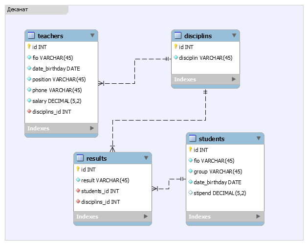

## Практическая часть работы:
### День 1
1.	Создайте папку c именем ```app``` командой ```mkdir``` в командной строке, а затем командой ```cd.  > README.md``` создайте файл описания.
2.	Перейдите в созданную папку командой ``cd <name_folder>``
3.	Инициализируйте проект в системе контроля версий Git ```git init```
4.	Сделайте первый коммит с сообщением initialize ```git add . && git commit -m "initialize"```
5.	Создайте новую ветку database и переключитесь на нее ```git checkout -b database```
6.	Посмотрите лог коммитов ```git log --graph --decorate –oneline ``` Также откройте GitGUI и посмотрите визуализацию истории коммитов (должен быть если установлен Git Bash)
7. Откройте MySQL Workbench. Создайте подключение, использую логин и пароль учетной записи. Или воспользуйтесь клиентом командной строки mysql.
8.	Перейдите в режим создания моделей
9.	Настройте физическую схему Physical Schemas (переименуйте mydb в название вашей базы данных)
10.	 Создайте ER модель таблиц teachers, students, results, disciplines. В настройках Model – Object Notation поставьте IDEF1X.
11.	Установите поля, атрибуты, связи ориентируясь на следующую диаграмму. 
    
    Например, создайте таблицу teachers со следующими столбцами: код преподавателя, фамилия, имя, отчество, дата рождения, должность, дисциплина, телефон, оклад. Имена столбцов на английском языке строчными буквами. Запрещено использовать написание русских слов английским алфавитом.
12.	 Сохраните модель ERD в формате pdf и формате png, а также файл модели MySQL Workbench (mwb). Файл в формате png далее потребуется для оформления README.md

13.	 Сделайте **Forward Engineering**. При генерации кода на языке SQL сохраните код в файл _dump.sql_. При необходимости отредактируйте скрипт генерации объектов базы данных (измените ограничения внешнего ключа на RESTRICT,удалите слова VISIBLE в индексах). **Замечание:** создать базу данных можно любым способом (программным или с помощью sql). Также можно совершить R**everse Engineering**, т.е. сначала написать скрипт генерации самостоятельно, а потом из него сгенерировать ERD модель.
14.	 Данные для заполнения таблицы содержаться в файлах teachers.txt, results.txt, disciplines.txt, students.txt в папке _data_source_. Отредактируйте данные так, чтобы они соответствовали 3НФ и импортировались без ошибок. **Замечание:** есть несколько способов импорта данных: средствами MySQL Workbench (xlsx, json), командой LOAD DATA из-под Workbench, командой LOAD DATA из-под командной строки, чистой командой INSET INTO. В любом случае сначала внимательно отредактируйте файлы для импорта, **начинайте импорт с таблиц, в которых нет связей**. Следите за ограничениями внешнего ключа. Также смотрите наличия поля id, должно быть строгое соответствие последовательности атрибутов в реальной таблице и в файле для импорта, возможно потребуется нормализация или денормализация.

### Возможные ошибки

```error
Error Code: 1046. No database selected Select the default DB to be used by double-clicking its name in the SCHEMAS list in the sidebar.
```
  **Solution:** use databasename


  
```Error Code: 1452. Cannot add or update a child row: a foreign key constraint fails (`decanat`.`teachers`, CONSTRAINT `fk_teachers_disciplins1` FOREIGN KEY (`disciplins_id`) REFERENCES `disciplines` (`id`))```
  
  **Solution:** В данном случает потребовалось прописать временное разрешение на игнорирование ограничений внешнего ключа 
  ```sql 
  SET FOREIGN_KEY_CHECKS=0
  ```


```
Error Code: 1175. You are using safe update mode and you tried to update a table without a WHERE that uses a KEY column To disable safe mode, toggle the option in Preferences -> SQL Editor and reconnect.
```
**Solution:** ```SET SQL_SAFE_UPDATES = 0```

15.	В папку с проектом внесите файлы для импорта отредактированные

16.	Сделайте ```git commit -m "Import copmliete" ``` после успешного импортирования всех данных.

17.	 Перейдите на ветку master ```git checkout master```
18.	 Слейте ветку database c веткой master ```git merge database```
 
19.	Создайте dump базы данных: схемы базы данных и данных. Для того найдите _Server/Data Export_ в MySQL Workbench. Или если у вас есть доступ к исполняемым файлам **mysqldump** можете воспользоваться скриптом.

```sql
mysqldump -u username -p password -h localhost databasename > "C:\script.sql"
```

### Проверка работы скрипта

```sql
mysql -u username -p password -h localhost databasename < "C:\script.sql"
```

20.	Сделайте **push** в удаленный репозиторий в ветку **database** в системе контроля версий Git. Проект должен содержать **диаграмму базы данных** в формате pdf и png, **dump базы данных**, **файл проекта модели MySQL Workbench**, **файл README.md** в подробное оформление на языке Markdown всех шагов работы в формате gif, также в документации должны быть скриншоты работы ```git log --oneline```.


21.	 Проверьте корректность отображения данных в удаленном репозитории

Например, изображения требуют полный путь

```html
<image src = "http://localhost/Bonobo.Git.Server/Repository/d076735c-f6a0-4942-965f-d0c8985f3c2a/master/Raw/images/decanat.png"><image>
```


### Возможные проблемы
```
 Git push results in "Authentication Failed"
```
**Решение:** возможно есть недопустимые символы в логине или пароле


---
# Результат отчета студента: 

## Создание серверной части приложения

## ERD модель


## Дамп базы данных <a href ="./dump.sql">Скачать</a>

## Код генерации объектов базы данных

```sql
-- MySQL Workbench Forward Engineering

SET @OLD_UNIQUE_CHECKS=@@UNIQUE_CHECKS, UNIQUE_CHECKS=0;
SET @OLD_FOREIGN_KEY_CHECKS=@@FOREIGN_KEY_CHECKS, FOREIGN_KEY_CHECKS=0;
SET @OLD_SQL_MODE=@@SQL_MODE, SQL_MODE='ONLY_FULL_GROUP_BY,STRICT_TRANS_TABLES,NO_ZERO_IN_DATE,NO_ZERO_DATE,ERROR_FOR_DIVISION_BY_ZERO,NO_ENGINE_SUBSTITUTION';

-- -----------------------------------------------------
-- Schema decanat
-- -----------------------------------------------------

-- -----------------------------------------------------
-- Schema decanat
-- -----------------------------------------------------
CREATE SCHEMA IF NOT EXISTS `decanat` DEFAULT CHARACTER SET utf8 ;
USE `decanat` ;

-- -----------------------------------------------------
-- Table `decanat`.`disciplins`
-- -----------------------------------------------------
CREATE TABLE IF NOT EXISTS `decanat`.`disciplins` (
  `id` INT NOT NULL AUTO_INCREMENT,
  `disciplin` VARCHAR(45) NOT NULL,
  PRIMARY KEY (`id`))
ENGINE = InnoDB;


-- -----------------------------------------------------
-- Table `decanat`.`teachers`
-- -----------------------------------------------------
CREATE TABLE IF NOT EXISTS `decanat`.`teachers` (
  `id` INT NOT NULL AUTO_INCREMENT,
  `fio` VARCHAR(45) NOT NULL,
  `date_birthday` DATE NOT NULL,
  `position` VARCHAR(45) NOT NULL,
  `phone` VARCHAR(45) NOT NULL,
  `salary` DECIMAL(5,2) NOT NULL,
  `disciplins_id` INT NOT NULL,
  PRIMARY KEY (`id`),
  INDEX `fk_teachers_disciplins1_idx` (`disciplins_id` ASC),
  CONSTRAINT `fk_teachers_disciplins1`
    FOREIGN KEY (`disciplins_id`)
    REFERENCES `decanat`.`disciplins` (`id`)
    ON DELETE RESTRICT
    ON UPDATE RESTRICT)
ENGINE = InnoDB;


-- -----------------------------------------------------
-- Table `decanat`.`students`
-- -----------------------------------------------------
CREATE TABLE IF NOT EXISTS `decanat`.`students` (
  `id` INT NOT NULL AUTO_INCREMENT,
  `fio` VARCHAR(45) NOT NULL,
  `group` VARCHAR(45) NOT NULL,
  `date_birthday` DATE NOT NULL,
  `stipend` DECIMAL(5,2) UNSIGNED NULL,
  PRIMARY KEY (`id`))
ENGINE = InnoDB;


-- -----------------------------------------------------
-- Table `decanat`.`results`
-- -----------------------------------------------------
CREATE TABLE IF NOT EXISTS `decanat`.`results` (
  `id` INT NOT NULL AUTO_INCREMENT,
  `result` VARCHAR(45) NOT NULL,
  `students_id` INT NOT NULL,
  `disciplins_id` INT NOT NULL,
  PRIMARY KEY (`id`),
  INDEX `fk_results_students_idx` (`students_id` ASC),
  INDEX `fk_results_disciplins1_idx` (`disciplins_id` ASC),
  CONSTRAINT `fk_results_students`
    FOREIGN KEY (`students_id`)
    REFERENCES `decanat`.`students` (`id`)
    ON DELETE RESTRICT
    ON UPDATE RESTRICT,
  CONSTRAINT `fk_results_disciplins1`
    FOREIGN KEY (`disciplins_id`)
    REFERENCES `decanat`.`disciplins` (`id`)
    ON DELETE RESTRICT
    ON UPDATE RESTRICT)
ENGINE = InnoDB;


SET SQL_MODE=@OLD_SQL_MODE;
SET FOREIGN_KEY_CHECKS=@OLD_FOREIGN_KEY_CHECKS;
SET UNIQUE_CHECKS=@OLD_UNIQUE_CHECKS;


```
## Файл MySQL Workbench модели <a href = "./decanat.mwb">Скачать</a>

## Скрипт для импорта <a href = "./load~20data.sql">Скачать</a>

## Модель в формате pdf <a href = "./decanat.pdf">Скачать</a>