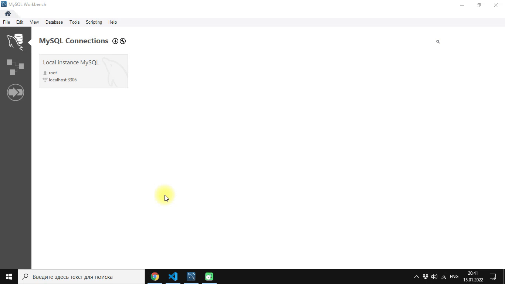
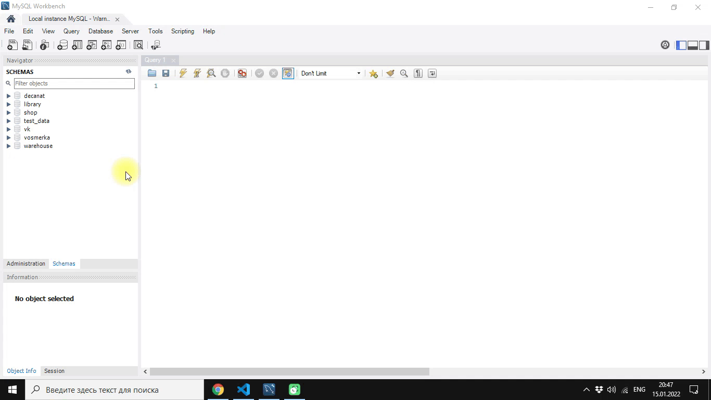
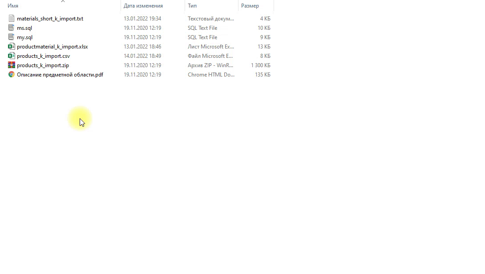

# Базы данных. SQL ( DML и DDL)

## Задание: 

## Восстановление базы данных из скрипта

Для восстановления таблиц в созданную базы данных воспользуйтесь предоставленным скриптом (ms.sql
или my.sql в зависимости от выбранной СУБД). В процессе разработки приложения Вы можете изменять
базу данных на свое усмотрение.

## Решение:
---

1. Зайдите в учетную запись **MySQl Workbench**



2. Создайте базу данных вручную или с использованием команды ```create database```. При создании базы данных примените кодировку ```utf8mb4```. Имя базы данных должно соответствовать предметной области, без использования русских букв, желательно, на английском языке.

```sql

create database <name database> character set utf8mb4 collate utf8mb4_general_ci

```


3. Сделайте созданную базу данных базой данных по умолчанию, используя команду ```use <name database>```. Или воспользуйтесь командой выпадающего списка **set default schema** при щелчке ПКМ на выбранной базе данных в MySQL Workbench




4. В папке ресурсов к сессии 1 найдите скрипт выполнения для сервера MySQL (```my.sql```). _В данной папке также существует скрипт для другой СУБД - SQL Server (```ms.sql```)._



5. Выполните скрипт, чтобы создать все таблицы предметной области в базе данных. Для быстрого выполнения с среде ```MySQL Workbench``` можно перенести файл ```my.sql``` в свободную область, далее ```Ctrl + A```, ```Ctrl + Shift + Enter```. 
   


6. Возможно, некоторые таблицы имеют синтаксические ошибки в скрипте, исправьте их. 
Ответ: посмотрите на таблицу, в которой возникла ошибка и исправьте тип поля datetime.


7. Выполните **Reverse Engeeniring**, чтобы построить ERD - диаграмму по готовой базе данных.


8. Измените нотацию объектов на IDEF1X. Обратите внимание, что для создания подсистемы нам нужны таблицы Product, Material. Эти таблицы связаны с таблицами ProductType, MaterialType. Также эти таблицы имеют между собой связь "многие-ко-многим", которая в реляционной модели данных реализуется в виде связующей таблицы ProductMaterial


9. Сохраните ER-диаграмму в виде pdf и png

