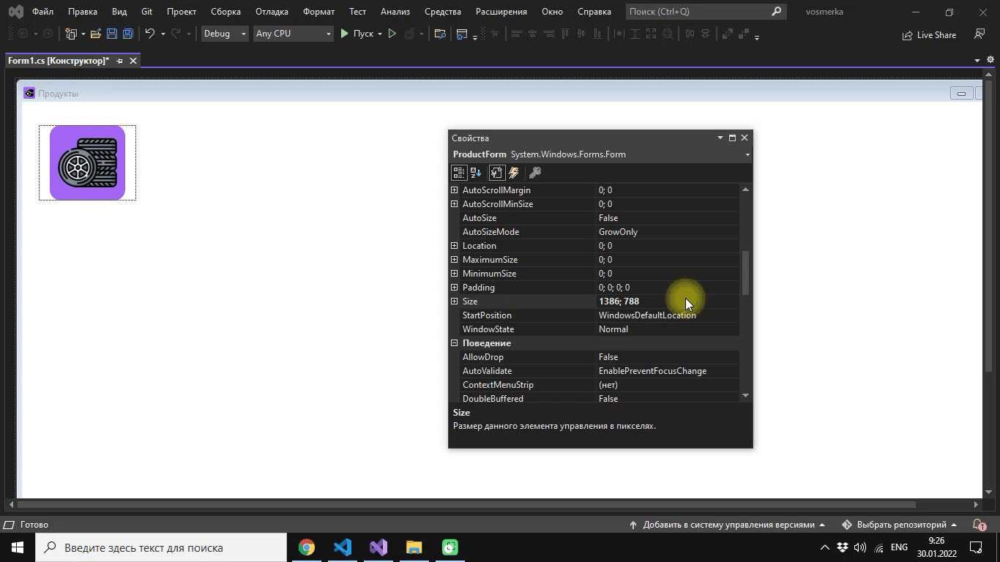
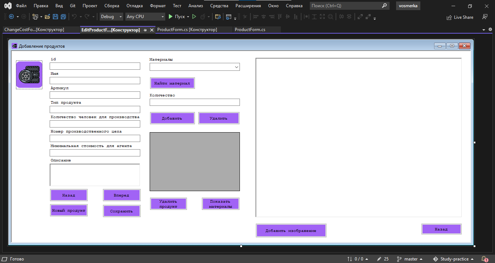
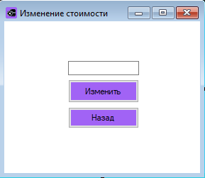

# 5. Создание проекта в Windows Forms

1. Откройте Visual Studio. Создайте проект Windows Forms


---

2. Откройте в общих ресурсах руководство по стилю и внимательно изучите его


3. Использование логотипа
Все экранные формы пользовательского интерфейса должны иметь заголовок с логотипом (в
ресурсах). Не искажайте логотип (не изменяйте изображение, его пропорции, цвет).
Также для приложений должна быть установлена иконка.

1. Шрифт
Используйте шрифт ```Courier New```.


---
5. Цветовая схема. В качестве основного фона используется белый цвет; в качестве дополнительного: ```#D3D3D3```.
Для акцентирования внимания пользователя на целевое действие интерфейса используйте цвет ```#A163F5```.


6. Создадим иконку формы и переименуем заголовок формы на ```Продукты```. Также переименуем имя формы  - ```ProductForm```
   


7. Поместите на форму логотип с помощью элемента управления ```Picture Box```.


8. Поменяйте фон формы на White


1.  Задайте размер формы ```ProductForm```



11. Создайте форму для редактирования ```EditProductForm```


12. По аналогии, создайте форму для изменения цены ```ChangeCostForm```

13. Создайте на форме ```ProductForm``` элементы на рисунке 1


14. Создайте на форме ```EditProductForm``` элементы на рисунке 2


15. Создайте на форме ```ChangeCostForm``` элементы на рисунке 3


16. Примените к каждой форме требования по стилю.
