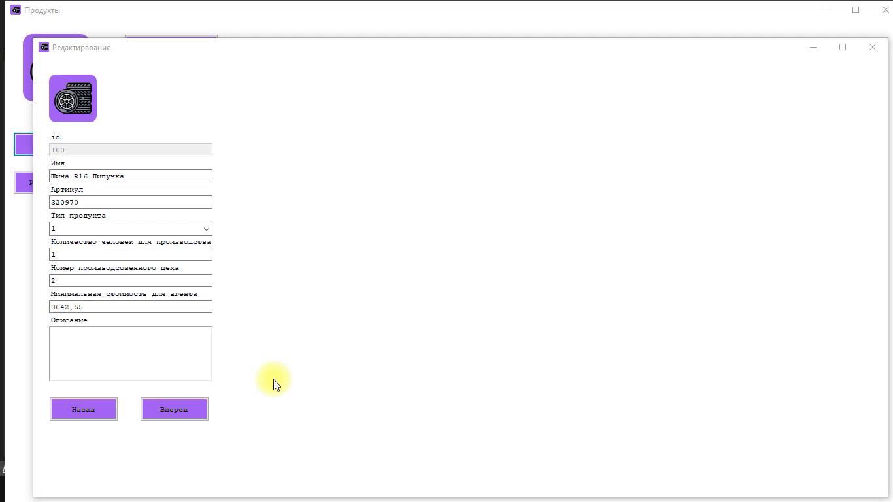
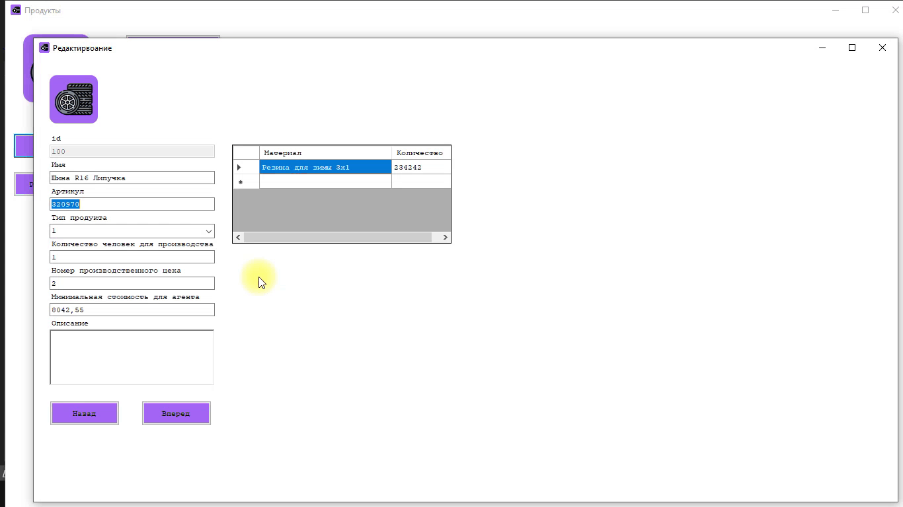
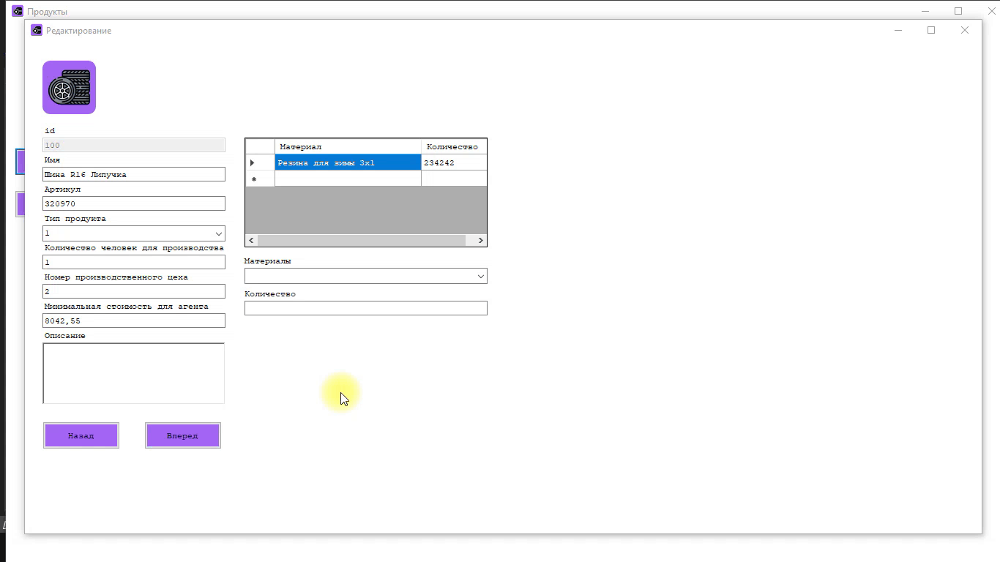
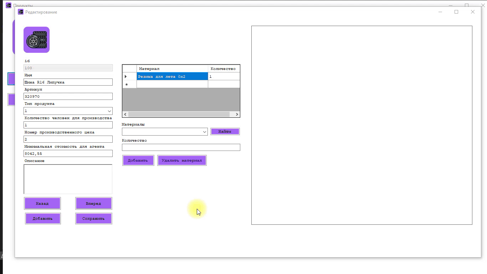
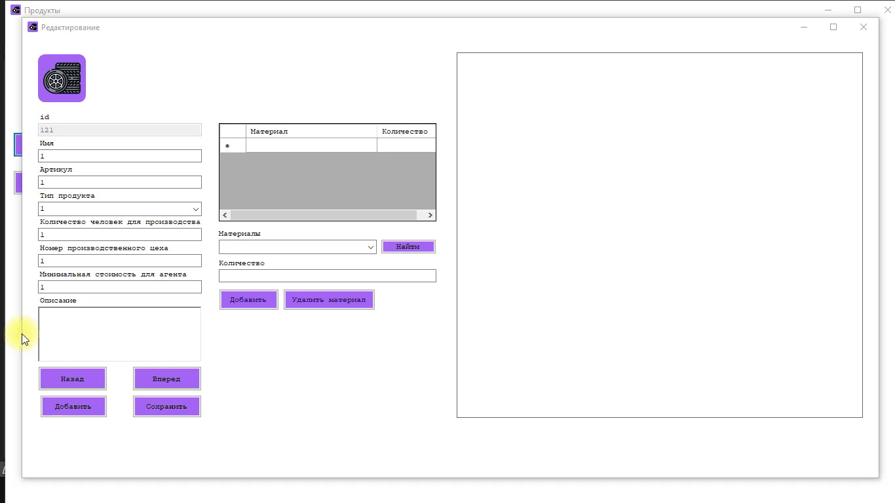

# Windows Forms. DataBinding

Добавление/редактирование продукции

20. Необходимо добавить возможность редактирования данных существующей продукции, а также
добавление новой продукции в новом окне - форме для добавления/редактирования продукции. Переходы на данное окно должны быть реализованы из главной формы списка: для редактирования - при нажатии на конкретный элемент, для добавления - при нажатии кнопки “Добавить продукцию”.

Создайте кнопку для перехода на форму Добавления/Редактирования продуктов ```EditProductForm```. Одна кнопка будет называться "Добавить", а другая кнопка "Редактировать". Обе кнопки будут вести на одну форму ```EditProductForm```. Так, код обработчика кнопки редактирвоания представлен ниже. Сделайте также для кнопки добавления.

```Csharp
private void editButton_Click(object sender, EventArgs e)
  {
    EditProductForm form = new EditProductForm();
    form.Show();
  }
```


**Замечание**: пусть кнопка редактирования включается только тогда, когда включается событие, когда пользователь отпускает кнопку мыши, когда указатель мыши находится на ячейке (CellMouseUp). Используйте свойство Enabled.


21. На форме должны быть предусмотрены следующие поля: артикул, наименование, тип продукта
(выпадающий список), изображение, количество человек для производства, номер производственного
цеха, минимальная стоимость для агента и подробное описание (с возможностью многострочного ввода).


23. При открытии формы для редактирования все поля выбранного объекта должны быть подгружены в
соответствующие поля из базы данных, а таблица заполнена актуальными значениями.

В переменные класса занесите следующие определения:

```Csharp
static string connection = @"server=localhost;userid=root;password=root;database=vosmerka;charset=utf8";
MySqlConnection connect = new MySqlConnection(connection);
BindingSource productBindingSourse = new BindingSource();
DataTable productTable = new DataTable();
DataTable materialTable = new DataTable();
```

Далее в обработчике загрузки формы ```EditProductForm```:

```Csharp

            idField.Enabled = false;
            //
            connect.Open();
            MySqlCommand cmd = connect.CreateCommand();

            MySqlDataAdapter adapter = new MySqlDataAdapter(cmd);
            cmd.CommandText = "select * from product order by id desc";
            DataSet dataset = new DataSet();
            adapter.Fill(dataset);

            // Добавляем столбец с изображением
            productTable = dataset.Tables[0];
            productTable.Columns.Add("ImagePic", Type.GetType("System.Byte[]"));

            foreach (DataRow row in productTable.Rows)
            {
                row["ImagePic"] = File.ReadAllBytes(row["Image"].ToString());
            }
            productBindingSourse.DataSource = productTable;
            
            // Настройка связывания для элементов:

            titleField.DataBindings.Add("Text", productBindingSourse, "Title");
            idField.DataBindings.Add("Text", productBindingSourse, "ID");
            typeProductcomboBox.DataBindings.Add("Text", productBindingSourse, "ProductTypeID"); // переделать
            articleField.DataBindings.Add("Text", productBindingSourse, "ArticleNumber");
            countPersonField.DataBindings.Add("Text", productBindingSourse, "ProductionPersonCount");
            numberWorkshopField.DataBindings.Add("Text", productBindingSourse, "ProductionWorkshopNumber");
            minCostField.DataBindings.Add("Text", productBindingSourse, "MinCostForAgent");
            descriptionField.DataBindings.Add("Text", productBindingSourse, "Description");
```


Создадим кнопки для навигации по продуктам. Для обработки кнопки "Вперед" используйте следующий код:

```Csharp
  productBindingSourse.MoveNext();
```

Для обработки кнопки "Назад" используйте следующий код:

```Csharp
  productBindingSourse.MovePrevious();
```




1.  *Также необходимо реализовать вывод списка материалов, используемых при производстве продукции, с
указанием количества. В список можно добавлять новые позиции и удалять существующие. При
добавлении материалы должны выбираться из выпадающего списка с возможностью поиска по
наименованию.

Вывод списка материалов для производства конкретного продукта и количество (из связующей таблицы). Мы подпишемся на события изменения поля с id, чтобы отображать актуальные материалы для каждого продукта.

Элемент: textBox c id
Событие: TextChanged

```Csharp

            // Выбираем название и количество материалов для производства продукта

            MySqlCommand cmdJoinProductMaterial = connect.CreateCommand();
            cmdJoinProductMaterial.CommandText = $"select title,count from productmaterial inner join material on materialID = id where productid = {idField.Text}";

            MySqlDataAdapter material_adapter = new MySqlDataAdapter(cmdJoinProductMaterial);
            DataSet material_dataset = new DataSet();
            material_adapter.Fill(material_dataset);

            materialTable = material_dataset.Tables[0];
            dataGridViewMaterial.DataSource = materialTable;
            dataGridViewMaterial.Columns[0].HeaderText = "Материал";
            dataGridViewMaterial.Columns[0].Width = 200;
            dataGridViewMaterial.Columns[1].HeaderText = "Количество";

```


Можно добавлять новые позиции и удалять существующие. При добавлении материалы должны выбираться из выпадающего списка. Есть строка поиска по материалам.

1. Добавим выпадающий список и метку "Материалы", а также текстовое поле и метку "Количество". Метка - это Label.
2. Далее надо добавить в выпадающий список все материалы из таблицы базы данных ```material```. Примените код при загрузке формы ```EditProductForm```.

```Csharp

            // добавление всех материалов в выпадающий список
            MySqlCommand cmdMaterial = connect.CreateCommand();
            cmdMaterial.CommandText = "select title from material";
            MySqlDataReader myReader = cmdMaterial.ExecuteReader();
            while (myReader.Read())
            {
                materialcomboBox.Items.Add(myReader[0]);
            }
            connect.Close();
```


3. Добавим две кнопки для добавления и удаления материалов в список dataGridViewMaterial. При этом материалы также должны добавляться и удаляться и из базы данных. Код обработчика кнопки "Добавить" представлен ниже:

```Csharp
            string newmaterial = materialcomboBox.SelectedItem.ToString();
            string newmaterialcount = countMaterialField.Text.ToString();
            materialTable.Rows.Add(newmaterial, newmaterialcount);

            // найти id материала

            try
            {
                string mysql = @"server=localhost;userid=root;password=root;database=vosmerka;Character Set=utf8";
                MySqlConnection connect = new MySqlConnection(mysql);
                connect.Open();
                MySqlCommand cmd = new MySqlCommand($"select id from material where Title = '{newmaterial}'", connect);
                MySqlDataReader result1 = cmd.ExecuteReader();


                while (result1.Read())
                {
                   idmaterial = result1[0].ToString();
                }


            }
            catch (Exception ex)
            {
                MessageBox.Show($"Ошибка: {ex}");
            }
            connect.Close();

            // добавление записи в связующую таблицу productmaterial

            connect.Open();
            MySqlCommand insertProductMaterial = connect.CreateCommand();
            MySqlDataAdapter insertProductMaterialadapter = new MySqlDataAdapter(insertProductMaterial);

            try
            {
                insertProductMaterialadapter.InsertCommand = new MySqlCommand($"insert into productmaterial(ProductID,MaterialID,Count) values('{idField.Text}','{idmaterial}','{newmaterialcount}')", connect);
                insertProductMaterialadapter.InsertCommand.ExecuteNonQuery();
                MessageBox.Show("Запись добавлена!");
            }
            catch (Exception ex)
            {
                MessageBox.Show($"Ошибка: {ex}");
            }

            connect.Close();
            dataGridViewMaterial.DataSource = materialTable;
```
**Замечание**: поместите ```idmaterial``` в переменные класса.


 

1. Присвоим переменной ```CurrentRow``` значение текущего индекса. Отследим действие по выбору строки в таблице материалов.

Элемент: dataGridViewMaterial
Событие: RowEnter

```Csharp        
private void dataGridViewMaterial_RowEnter(object sender, DataGridViewCellEventArgs e)
        {
            CurrentRow = e.RowIndex;
        }
```
   

4. Код для удаления материала примените также:


```Csharp
try
{
    if (MessageBox.Show("Вы действительно хотите удалить продукт?", "Удалить", MessageBoxButtons.YesNo) == DialogResult.Yes)
    {

        string currentMaterial = materialTable.Rows[CurrentRow].ItemArray.GetValue(0).ToString();
        materialTable.Rows[CurrentRow].Delete();

        string mysql = @"server=localhost;userid=root;password=root;database=vosmerka;Character Set=utf8";
        MySqlConnection connect = new MySqlConnection(mysql);
        connect.Open();
        MySqlCommand findIdMaterial = connect.CreateCommand();
        MySqlDataAdapter findIdMaterialadapter = new MySqlDataAdapter(findIdMaterial);
        MySqlCommandBuilder sBuilder = new MySqlCommandBuilder(findIdMaterialadapter);

        MySqlCommand cmd = new MySqlCommand($"select id from material where Title = '{currentMaterial}'", connect);
        string idmaterial = cmd.ExecuteScalar().ToString();
        //
        MySqlCommand delCommand = connect.CreateCommand();
        MySqlDataAdapter deladapter = new MySqlDataAdapter(delCommand);
        MySqlCommandBuilder delBuilder = new MySqlCommandBuilder(deladapter);

        deladapter.DeleteCommand = new MySqlCommand($"delete from productmaterial where ProductID = '{idField.Text}' and MaterialID = '{idmaterial}'", connect);
        deladapter.DeleteCommand.ExecuteNonQuery();
        MessageBox.Show("Материал удален из состава продукта ");

    }
}
catch (Exception ex)
{
    MessageBox.Show($"Ошибка: {ex}");
}

```
**Замечание**: ``` int CurrentRow ``` поместите в переменные класса.


5. Настроим поиск по материалам в выпадающем списке. Для этого создадим кнопку "Найти". Далее в обработчике кнопки пропишите следующий код:

```Csharp

int index = materialcomboBox.FindString(materialcomboBox.Text);
materialcomboBox.SelectedIndex = index;

```

**Задание**: сделайте так, чтобы при отсутствии результатов поиска выводилось сообщение об отсутствии результатов поиска.


**Readme**: оформить тему "Подгрузка данных в поля редактирования". Сделать screenshot
**Git**: сделать соmmit с сообщением "Подгрузка данных в поля редактирования"


1. Создадим две кнопки для добавления и редактирования продуктов. Назовем кнопки "Добавить" и "Сохранить". Также создадим элемент ```PictureBox``` для отображения изображения и поставим отображение границ ```Border Style```. Обработчик кнопки "Добавить" очищает все поля:

```Csharp

//idField.Clear();
titleField.Clear();
articleField.Clear();
numberWorkshopField.Clear();
countMaterialField.Clear();
countPersonField.Clear();
minCostField.Clear();  
descriptionField.Clear();
imageFieldPictureBox.Image = null;
dataGridViewMaterial.DataSource = null;

```


Обработчик кнопки "Сохранить":

```Csharp

            MySqlConnection connect = new MySqlConnection(connection);
            connect.Open();

            MySqlCommand cmd = connect.CreateCommand();
            cmd.CommandText = "select * from product";
            MySqlDataAdapter adapter = new MySqlDataAdapter(cmd);

            // Поиск по id
            MySqlCommand searchCurrentArticle = connect.CreateCommand();
            searchCurrentArticle.CommandText = $"select count(*) from product where Title = '{titleField.Text}' and ArticleNumber = '{articleField.Text}' and MinCostForAgent = '{minCostField.Text.Replace(",", ".")}' and ProductionPersonCount = '{countPersonField.Text}' and ProductionWorkshopNumber = '{numberWorkshopField.Text}' and ProductTypeID = '{typeProductcomboBox.Text}' and Description = '{descriptionField.Text}'";
            

            if (idField.Text == "")
            {
                try
                {
                    adapter.InsertCommand = new MySqlCommand($"insert into product(Title,ArticleNumber,MinCostForAgent,ProductionPersonCount,ProductionWorkshopNumber,ProductTypeID) values('{titleField.Text}',{articleField.Text},{minCostField.Text.Replace(",", ".")},{countPersonField.Text},{numberWorkshopField.Text},{typeProductcomboBox.Text})", connect);
                    adapter.InsertCommand.ExecuteNonQuery();
                    MessageBox.Show("Продукт сохранен в базу данных");
                }
                catch (MySql.Data.MySqlClient.MySqlException ex)
                {
                    MessageBox.Show($"Ошибка MySQL сохранения: {ex.Message}");
                }
                catch (Exception ex)
                {
                    MessageBox.Show($"Ошибка сохранения: {ex.Message}");
                }
            }
            else
            {
                try
                {
                    adapter.UpdateCommand = new MySqlCommand($"update product set Title = '{titleField.Text}', ArticleNumber = '{articleField.Text}', MinCostForAgent = '{minCostField.Text.Replace(",", ".")}',ProductionPersonCount = '{countPersonField.Text}',ProductionWorkshopNumber = '{numberWorkshopField.Text}',ProductTypeID = '{typeProductcomboBox.Text}',Description = '{descriptionField.Text}' where ID = '{idField.Text}'", connect);
                    adapter.UpdateCommand.ExecuteNonQuery();
                    MessageBox.Show("Продукт обновлен в базе данных");
                }
                catch (MySql.Data.MySqlClient.MySqlException ex)
                {
                    MessageBox.Show($"Ошибка MySQL обновления: {ex.Message}");
                }
                catch (Exception ex)
                {
                    MessageBox.Show($"Ошибка обновления: {ex}");
                }
            }
            connect.Close();

            productBindingSourse.DataSource = productTable;

```


2.  Стоимость продукции может включать сотые части, а также не может быть отрицательной.

Сделайте проверку на уровне базы данных, чтобы поле цены не было отрицательным. Для 
этого используйте свойство столбца ```unsigned```.


Система должна проверять существование продукта с введенным артикулом и не давать использовать один артикул для нескольких продуктов.

Постав индекс uniq на артикул. Обработать исключение на uniq в С#.


1. Сделаем валидацию поля цены.

Элемент: textBox (полей цены)
Событие: Validating

Далее, сдейлайте необходимые валидации на каждое текстовое поле в приложении.

```Csharp

 if (textBox4.Text == " ")
            {
                e.Cancel = false;
                MessageBox.Show("Цена не может быть пустой");

            }
 
            else
            {
                try
                {
                    double.Parse(textBox4.Text);
                    e.Cancel = false;
                }
                catch
                {
                    e.Cancel = true;
                    MessageBox.Show("Поле не может содержать буквы");
                    e.Cancel = false;
                }
            };

            try
            {
                if (double.Parse(textBox4.Text) < 0)
                {
                    e.Cancel = true;
                    MessageBox.Show("Цена не может быть отрицательной");
                }
            }
            catch
            {
                MessageBox.Show("Цена должна состоять из цифр");
            }


```




**Readme**: оформить тему "Валидация". Сделать screenshot
**Git**: сделать соmmit с сообщением "Валидация"

---


1.  Пользователь может добавить/заменить изображение у продукции. Создадим кнопку "Добавить изображение". Далее следует обработчик кнопки:

```Csharp

 using (OpenFileDialog dlg = new OpenFileDialog())
            {
                dlg.Title = "Open Image";
                dlg.Filter = "png files (*.jpg)|*.jpg";
                dlg.InitialDirectory = "./";
                //dlg.FileName.Replace(@"\",@"/");
                if (dlg.ShowDialog() == DialogResult.OK)
                {
                    PictureBox PictureBox1 = new PictureBox();

                    // Create a new Bitmap object from the picture file on disk,
                    // and assign that to the PictureBox.Image property
                    PictureBox1.Image = new Bitmap(dlg.FileName);

                    string mysql = @"server=localhost;userid=root;password=root;database=vosmerka;Character Set=utf8";
                    MySqlConnection connect = new MySqlConnection(mysql);
                    connect.Open();
                    MySqlCommand findIdProduct = connect.CreateCommand();
                    MySqlDataAdapter findIdProductadapter = new MySqlDataAdapter(findIdProduct);
                    MySqlCommandBuilder sBuilder = new MySqlCommandBuilder(findIdProductadapter);

                    findIdProductadapter.UpdateCommand = new MySqlCommand($"update product set Image = 'products/{dlg.SafeFileName}' where id = '{idField.Text}'", connect);
                    findIdProductadapter.UpdateCommand.ExecuteNonQuery();
                    MessageBox.Show("Изображение обновлено в базе данных");
                    findIdProductadapter.Update(productTable);
                }
            }

```


Для того, чтобы в поле pictureBox отображалась картинка нужно добавить данное поле в привязку DataBinding. Добавьте следующую строку в обработчик загрузки формы ```EditProductForm``` для привязки productDataBinding. Также в свойстве ```Size Mode``` поставьте значение ```Zoom```.

```Csharp

imageFieldPictureBox.DataBindings.Add(new Binding("Image", productBindingSourse, "ImagePic", true));

```

**Readme**: оформить тему "Изменение изображения". Сделать screenshot
**Git**: сделать соmmit с сообщением "Изменение изображения"

---

---
1.  Для того чтобы администратор случайно не изменял несколько продуктов, предусмотрите невозможность
открытия более одного окна редактирования.

В обработчике кнопки добавить формы ```ProductForm``` примените метод для объекта формы ```ShowDialog``` вместо просто метода ```Show```.


---

1.  В окне редактирования продукта должна присутствовать кнопка “Удалить”, которая удаляет продукт из
базы данных. При этом должны соблюдаться следующие условия. Если у продукта есть информация о
материалах, используемых при его производстве, или история изменения цен, то эта информация должна
быть удалена вместе с продуктом. Но если у продукта есть информация о его продажах агентами, то
удаление продукта из базы данных должно быть запрещено. После удаления продукта система должна
сразу вернуть пользователя обратно к списку продукции.

  **Условия удаления**:
  27.1. Если у продукта есть информация о материалах, используемых при его производстве и если у продукта есть история изменения цен, то при удалении продукта вся информация по этому ключу должна удаляться во всех связанных таблицах.
  28.3. То есть мы должны вместе с родительским элементом удалить все дочернии материалы, а также должны удалить записи в файле об изменении цены. Проверьте ограничения целостности при операциях удаления и обновления данных. Опции ```on delete cascade``` и ```on update cascade``` на внешние ключи ```product_id```
  29.4. Проверить если в продажах агентов данный товар. Если есть - запретить удаление. Здесь идет проверка по таблице ```productsale```. Учтите, что по исходному скрипту базы данных в таблице ```productsale``` следует указать внешний ключи из таблице ```agents```, а таблице ```agents``` требуется указать внешний ключ из таблицы ```agenttype```. Следовательно, сделайте соответствующие записи во всех действующих таблицах, для корректного удаления продукта.
  30.5. После успешного удаления перейти на **ProductForm**. Используйте операцию закрытия текущей формы ```this.Hide()```.


1. Создадим кнопку "Удалить". Обработчик кнопки:

```Csharp

            MySqlConnection connect1 = new MySqlConnection(connection);
            connect1.Open();

            MySqlCommand cmd = connect1.CreateCommand();
            cmd.CommandText = "select * from product";
            MySqlDataAdapter adapter = new MySqlDataAdapter(cmd);

            // Проверка возможности удаления продукта

            MySqlCommand detectSaleProductCmd = new MySqlCommand($"select * from productsale where ProductID = '{idField.Text}' limit 1", connect1);
            MySqlDataReader result1 = detectSaleProductCmd.ExecuteReader();

            if (result1.Read())
            {

                MessageBox.Show("Удаление запрещено! Есть данные о продажах продукта!");
                result1.Close();
                this.Hide();
            }
            else
            {
                result1.Close();
                if (MessageBox.Show("Вы действительно хотите удалить продукт?", "Удалить", MessageBoxButtons.YesNo) == DialogResult.Yes)
                {

                    adapter.DeleteCommand = new MySqlCommand($"delete from product where ID = {idField.Text}", connect1);
                    adapter.DeleteCommand.ExecuteNonQuery();

                    MessageBox.Show("Продукт удален из базы данных");

                    this.Hide();  // система переходи к списку продукции
                }
            }
        
```


**Readme**: оформить тему "Удаление продукта". Сделать screenshot
**Git**: сделать соmmit с сообщением "Удаление продукта"


1. Перейдем к коду формы ```ProductForm``` и добавим функцию перехода на форму редактирвоания ```EditProductForm``` по double-click по строке DataGridView.

Объект: DataGridView
Событие: CellMouseDoubleClick

```Csharp

EditProductForm form = new EditProductForm();
form.ShowDialog();

```


1. Далее сделаем, чтобы по умолчанию после события doubleclick в поля редактирования подгружаются выделенные поля из DataGridView. Определим в загрузчик формы ```EditProductForm``` следующий код:

```Csharp

// Логика поведения данных при dobleclick по строке DataGridView

            if (Info.Title == null)
            {
                productBindingSourse.DataSource = productTable;
            }
            else
            {
                titleField.Text = Info.Title;
            };


            if (Info.ID != null)
            {
                idField.Text = Info.ID;
            }
            else
            {
                productBindingSourse.DataSource = productTable;
            };


            if (Info.ProductTypeID != null)
            {
                typeProductcomboBox.Text = Info.ProductTypeID;
            }
            else
            {
                productBindingSourse.DataSource = productTable;
            };


            if (Info.ArticleNumber != null)
            {
                articleField.Text = Info.ArticleNumber;
            }
            else
            {
                productBindingSourse.DataSource = productTable;
            };

            if (Info.ProductionWorkshopNumber != null)
            {
                numberWorkshopField.Text = Info.ProductionWorkshopNumber;
            }
            else
            {
                productBindingSourse.DataSource = productTable;
            };

            if (Info.ProductionPersonCount != null)

            {
               countPersonField.Text = Info.ProductionPersonCount;
            }
            else
            {
                productBindingSourse.DataSource = productTable;
            };

            if (Info.MinCostForAgent != null)
            {
                minCostField.Text = Info.MinCostForAgent;
            }
            else
            {
                productBindingSourse.DataSource = productTable;
            };

            if (Info.Description != null)
            {
                descriptionField.Text = Info.Description;
            }
            else
            {
                productBindingSourse.DataSource = productTable;
            }

```


2. После редактирования/добавления/удаления продукции данные в окне списка продукции должны быть
обновлены. Для этого создадим метод ```LoadProduct``` который будет обновлять даннные в DataGridView. Он будет выполнять такие же функции, как и метод ```ProductLoad```.

```Csharp

    MySqlConnection connection = new MySqlConnection(connectionString);
    connection.Open();
    productCommand = new MySqlCommand("SELECT * FROM product", connection);
    productAdapter = new MySqlDataAdapter(productCommand);


    productDataset = new DataSet();

    productAdapter.Fill(productDataset, "product");

    productTable = productDataset.Tables["product"];

    productTable.Columns.Add("ImagePic", Type.GetType("System.Byte[]"));
    productTable.Columns.Add("Materials");
    productTable.Columns.Add("Cost");

    foreach (DataRow row in productTable.Rows)
    {
        row["ImagePic"] = File.ReadAllBytes(row["Image"].ToString());
    }

    // Находим материалы и считаем стоимость

    dataGridViewProduct.DefaultCellStyle.WrapMode = DataGridViewTriState.True;
    foreach (DataRow row in productTable.Rows)
    {

        MySqlConnection connect = new MySqlConnection(connectionString);
        connect.Open();
        MySqlCommand cmdFindMaterials = connect.CreateCommand();
        cmdFindMaterials.CommandText = $"select material.title,productmaterial.count,material.cost from productmaterial join material on productmaterial.materialid = material.id where ProductID = {row["ID"]}";
        MySqlDataReader MaterialsReader = cmdFindMaterials.ExecuteReader();

        decimal sum = 0;
        row["Materials"] = row["Cost"] = "";
        while (MaterialsReader.Read())
        {
            //MessageBox.Show(MaterialsReader[0].ToString());

            row["Materials"] = row["Materials"] + MaterialsReader[0].ToString() + Environment.NewLine;
            row["Cost"] = sum + (Convert.ToDecimal(MaterialsReader[1]) * Convert.ToDecimal(MaterialsReader[2]));
            sum = (Convert.ToDecimal(MaterialsReader[1]) * Convert.ToDecimal(MaterialsReader[2]));
        }

        connect.Close();
    }

    dataGridViewProduct.DataSource = productTable;

    DataGridViewColumn column = dataGridViewProduct.Columns[9];
    ((DataGridViewImageColumn)dataGridViewProduct.Columns[9]).ImageLayout = DataGridViewImageCellLayout.Zoom;

    dataGridViewProduct.RowsDefaultCellStyle.BackColor = Color.WhiteSmoke;
    dataGridViewProduct.RowsDefaultCellStyle.SelectionBackColor = Color.MediumPurple;


    // Подсветить продукты, которые не продавались в течении месяца

    var listOfStrings = new List<string>();

    MySqlCommand cmdFindProductSale = connection.CreateCommand();
    cmdFindProductSale.CommandText = "select ProductId from productsale where SaleDate not between DATE_ADD(current_date(), INTERVAL -2 MONTH) and current_date()";
    MySqlDataReader myReader = cmdFindProductSale.ExecuteReader();

    int i = 0;
    while (myReader.Read())
    {
        listOfStrings.Add(myReader[0].ToString());
        i = i + 1;
    }

    //

    foreach (DataGridViewRow row in dataGridViewProduct.Rows)
    {
        if (listOfStrings.Contains(row.Cells[0].Value.ToString()))
        {
            dataGridViewProduct.Rows[row.Index].DefaultCellStyle.BackColor = Color.PaleVioletRed;
        };
    }
    connection.Close();

```

Далее надо применить метод ```LoadProduct``` по событию активации формы, т.е. когда фокус перемещается на форму, то будет выполняться метод.

Объект: текущая форма
Событие: Activated

```Csharp

LoadProduct();

```


Обновление, добавление, удаление работает в реальном времени


Далее создайте метод ```LoadProductForm``` в классе ```EditProductForm```:

```Csharp

            // Состояния
            idField.Enabled = false;
            //
            connect.Open();
            MySqlCommand cmd = connect.CreateCommand();

            MySqlDataAdapter adapter = new MySqlDataAdapter(cmd);
            cmd.CommandText = "select * from product order by id desc";
            DataSet dataset = new DataSet();
            adapter.Fill(dataset);

            // Добавляем столбец с изображением
            productTable = dataset.Tables[0];
            productTable.Columns.Add("ImagePic", Type.GetType("System.Byte[]"));

            foreach (DataRow row in productTable.Rows)
            {
                row["ImagePic"] = File.ReadAllBytes(row["Image"].ToString());
            }

            productBindingSourse.DataSource = productTable;

            imageFieldPictureBox.DataBindings.DefaultDataSourceUpdateMode = DataSourceUpdateMode.OnPropertyChanged;
            connect.Close();

```
С помощью данного метода сделайте так, чтобы при добавлении нового продукта его можно было сразу же просмотреть в полях редактирования. При добавлении нового изображения оно обновлялось в форме.

**Readme**: оформить тему "Автообновление". Сделать screenshot
**Git**: сделать соmmit с сообщением "Автообновление"

---

Создайте на формах ```EditProductForm``` и ```CostChangeForm``` кнопки "Назад". В обработчиках формы пропишите следующий код:

```Csharp

this.Close();

```
**Задание**: сделайте метод ```ShowPage``` так, чтобы он отображал изображения, материалы и стоимость
```


---
**Дополнительный материал:**
Рассмотрим задачу передачи объека формы и вызов метода этого объекта из другой формы. Если нам надо вызвать метод ```LoadProduct```, который является методом класса ```ProductForm``` из формы (класса) ```EditProductForm```. Для этого также применим класс ```Info```. В классе ```Info``` создадим статическое поле:

```Csharp

public static ProductForm ProductForm { get; set; }

```

Далее в конструкторе ```ProductForm``` запишем следующую строку:

```Csharp

Info.ProductForm = this;

```

Значит, из формы ```EditProductForm``` мы может вызвать метод класса ```ProductForm```

```Csharp

Info.ProductForm.LoadProduct();

```

