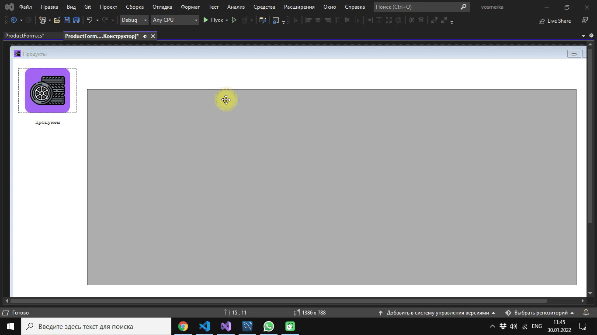
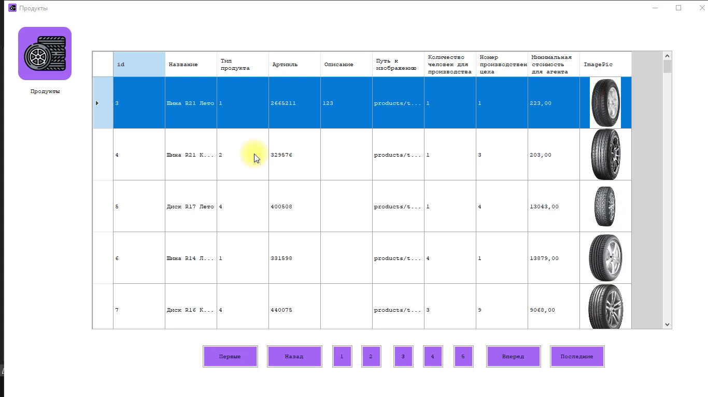

## Windows Forms. Подключение к базам данных. Вывод данных в DataGridView


**Список продукции**

6. Сделаем надпись Продукты на форме ```ProductForm``` рядом с логотипом.


7. Необходимо реализовать вывод продукции, которая хранится в базе данных, согласно предоставленному
макету. 


При отсутствии изображения необходимо вывести картинку-заглушку из ресурсов (picture.png).


**Решение**: вывод продукции будем выводить через формирование select запроса из базы данных с выводом данных в контейнер DataGridVieW. Далее следует поставить путь к картинке-заглушке в качестве значения по умолчанию (default) для поля Image в таблице product. При этом разрешить оставлять значения null.

Также удалим из файлов импорта product слова "не указано", "нет", "отсутствует". Вместо этих значений подставим ```picture.png```. Важно поменять в путях "\" на "/". При указании значения адреса пути указывайте текущую папку, либо "./image.png", либо "image.png", например.


**Замечание**: Файлы изображений в базе данных храняться в виде относительных ссылок. В проекте Windows Forms приложение ищет физические изображения в папке Debug в папке проекта. Кроме того, заглушка должна быть вынесена в значение default поля image в базе данных. Это потребуется в дальнейшем при добавлении новых записей без картинок.


1. Подключим в проект библиотеку для работы с СУБД MySQL. Загрузим в проект MySql.Data.dll (файл расположен в общих ресурсах)


1.  Используем директиву ```using MySql.Data``` и using ```MySql.Data.MySQLClient``` для подключения библиотеки.

```c#
using MySql.Data;
using MySql.Data.MySqlClient;
```


9.  Подготовим для вывода продукции элемент DataGridVieW.


10. Проверим подключение к базе данных


Для этого выполним обработку события по загрузке формы ```ProductForm```.  Далее выполним двойной клик по форме ```ProductForm```. Данное действие приведет к созданию обработчика события загрузки формы. Ниже представлен код обработчика формы:




Проинициализируйте переменные в классе ```ProductForm```

```Charp
        MySqlCommand productCommand;
        MySqlDataAdapter productAdapter;
        DataSet productDataset;
        DataTable productTable;
```


Далее проверим подключение к базе данных. При этом сделаем обработу исключений с помощью блоков ```try - catch```. База данных должна быть в кодировке ```utf8```. При необходимости, измените кодировку в скрипте.

```Csharp

        private void ProductForm_Load(object sender, EventArgs e)
        {

            string connectionString = @"server=localhost;userid=root;password=root;database=vosmerka;charset=utf8";
            string sql = "SELECT * FROM product";
            MySqlConnection connection = new MySqlConnection(connectionString);

            try
            {
                connection.Open();
                productCommand = new MySqlCommand(sql, connection);
                productAdapter = new MySqlDataAdapter(productCommand);
                productDataset = new DataSet();
                productAdapter.Fill(productDataset, "product");
                productTable = productDataset.Tables["product"];

                connection.Close();
                MessageBox.Show("Успешное соединение с базой данных!");
            }
            catch
            {
                MessageBox.Show("Нет соединения с базой данных!");
            }

            
        }

```

В поле
```csharp
string connectionString = @"server=localhost;userid=root;password=root;database=vosmerka;charset=utf8";
```
надо прописать ваши конкретные учетные данные для подключения.


1. Теперь когда есть подключение к базе данных сделаем источник данных к элементу ```DataGridView```. Для этого добавьте строку в обработчик загрузки формы после в блок ```try``` перед строкой закрытия соединения. Проверьте, что вы создали на форме элемент DataGridView.

```Csharp
dataGridViewProduct.DataSource = productTable;
```
Результат вывода списка продукции из базы данных представлен ниже


**Дополнительное задание:** отредактируйте названия столбцов в DataGrid таблице в соотвествии с реальными названиями таблиц (можно посмотреть в файлах для импорта). 


**Дополнительное задание:** сделайте таблицу только для чтения, используя свойсто объекта DataGridView, которое называется ReadOnly. Это нужно сделать при загрузке формы.


1.  Сделаем дополнительный фон ```#D3D3D3``` для DataGrid


---
### Контрольная точка 1
**Readme**: оформить тему "Вывод продуктов". Сделать screenshot
**Git**: сделать соmmit с сообщением "Вывод продуктов"

---


**Задание**. В случае если в базе более 20 продуктов, то вывод должен осуществляться постранично (по 20 продуктов на страницу). Для удобства навигации по страницам необходимо вывести список их номеров (как на макете) с возможностью перехода к выбранной странице, а также предусмотреть переходы к предыдущей и следующей страницам.

1. Найдем количество записей в таблице product с помощью MySQL Workbench


1. Создадим метод, который будет возвращать заданное количество записей в DataGridView

```Csharp
public void ShowPage(int pageStart, int pageCount, string stream = " ")

        {

            if (stream == "+")
            {
                scrollVal = scrollVal + pageCount;
                if (scrollVal > 100)  // 100 - это количество записей в таблице
                {
                    scrollVal = 100;
                }
            }

            if (stream == "-")
            {
                scrollVal = scrollVal - pageCount;
                if (scrollVal <= 0)
                {
                    scrollVal = 0;
                }
            }

            DataSet productSet = new DataSet();

            productAdapter.Fill(productSet, pageStart, pageCount, "product");
            productTable = productSet.Tables["product"];
            
            productTable.Columns[0].ColumnName = "id";
            productTable.Columns[1].ColumnName = "Title";
            productTable.Columns[2].ColumnName = "ProductTypeID";
            productTable.Columns[3].ColumnName = "ArticleNumber";
            productTable.Columns[4].ColumnName = "Description";
            productTable.Columns[5].ColumnName = "Image";
            productTable.Columns[6].ColumnName = "ProductionPersonCount";
            productTable.Columns[7].ColumnName = "ProductionWorkshopNumber";
            productTable.Columns[8].ColumnName = "MinCostForAgent";

            dataGridViewProduct.DataSource = productTable;

          
        }

```

Данный метод использует счетчик scrollVal, который является переменной класса. Проинициализируйте переменную scrollVal. Далее в конструкторе присвойте ей начальное значение 0;

Теперь можно применить данный  метод, чтобы выводить на странице по определенному количеству записей из базы данных. Например, для создания кнопки "Вперед" мы можем использовать следующий обработчик (forwardPageButton - это имя кнопки):

```Csharp
        private void forwardPageButton_Click(object sender, EventArgs e)
        {
            ShowPage(scrollVal, 20, "+");
        }
```

1. Изучите методе ShowPage и реализуйте на основе метода кнопки для просмотра первых 20 записей, последних 20 записей и предыдущих 20 записей и следующих 20 записей, а также последовательно первые 5 страниц (см. рисунок 1).


1. В результате у вас должно получиться


По заданию, если в нашей базе данных более 20 продуктов, то только тогда надо применять постраничный просмотр. То есть показывать кнопки навигации. Примените следующий код при загрузке формы:

```Csharp
            MySqlConnection connectCount = new MySqlConnection(connectionString);
            connectCount.Open();
            MySqlCommand CountCmd = new MySqlCommand("SELECT count(*) FROM product", connectCount);
            int count = Convert.ToInt32(CountCmd.ExecuteScalar());

            if (count < 20)
            {
                previosPageButton.Visible = forwardPageButton.Visible = backPageButton.Visible = endPageButton.Visible = false;
                page1Button.Visible = page2Button.Visible = page3Button.Visible = page4Button.Visible = page5Button.Visible = false;
            }
            connectCount.Close();
            //
            dataGridViewProduct.Refresh();
```


**Readme**: оформить тему "Создание постраничного просмотра". Сделать скриншоты работы всего функционала.
**Git**: сделать соmmit с сообщением "Создание постраничного просмотра"

---

1. Добавим отображение изображений в DataGridView по пути, которыей храниться в базе данных. Для этого после после создания  таблицы ```productTable`` мы можем добавить дополнительный столбец, который и будет содержать изображения продуктов

```Csharp
productTable.Columns.Add("ImagePic", Type.GetType("System.Byte[]"));
```

Теперь можно пройтись по каждой строке таблице в цикле и отобразить изображение по пути

```Csharp
foreach (DataRow row in productTable.Rows)
    {
        row["ImagePic"] = File.ReadAllBytes(row["Image"].ToString());
    }
```
**Замечание**: так как читается файл по байтам, то не забудьте подключить ```System.IO```

Ниже представлен ожидаемый результат


Чтобы корректно отображать изображение определим режим картинке в DataGridView в обработчике загрузки формы ```ProductForm```:

```Csharp

DataGridViewColumn column = dataGridViewProduct.Columns[9];
            column.AutoSizeMode = DataGridViewAutoSizeColumnMode.Fill;
            ((DataGridViewImageColumn)dataGridViewProduct.Columns[9]).ImageLayout = DataGridViewImageCellLayout.Zoom;

```

Далее сделаем высоту строк равной 100. Для этого в конструкторе пропишем следующую строку

```Csharp
this.dataGridViewProduct.RowTemplate.Height = 100;
```


---

По умолчанию сделаем, что в момент загрузки формы выводится первые 20 записей из базы данных.


1.  Стоимость продукта должна быть рассчитана исходя из используемых материалов.

**Решение**: надо создать дополнительный столбец ```Стоимость```, который будет являться вычислимым. Тут надо проводить анализ связи многие-ко-многим в таблице ```MaterialProducts```. Искать для каждого продукта материалы, смотреть сколько они стоят и количество и из этого всего выводить стоимость продукта.


1. Создадим дополнительные столбцы в DataGridView: материалы и стоимость. Для этого добавим следующий код

```Csharp
productTable.Columns.Add("Materials");
productTable.Columns.Add("Cost");
```
Кроме того, сделайте названия новых столбцов в DataGridView.


Далее, надо вычислить стоимость продукта по стоимости и количеству материалов, которые нужны для его изготовления. Ниже представлен фрагмент кода для обработчика загрузки формы ```ProductForm```

```Csharp

// Находим материалы и считаем стоимость

            dataGridViewProduct.DefaultCellStyle.WrapMode = DataGridViewTriState.True;
            foreach (DataRow row in productTable.Rows)
            {

                MySqlConnection connect = new MySqlConnection(connectionString);
                connect.Open();
                MySqlCommand cmdFindMaterials = connect.CreateCommand();
                cmdFindMaterials.CommandText = $"select material.title,productmaterial.count,material.cost from productmaterial join material on productmaterial.materialid = material.id where ProductID = {row["ID"]}";
                MySqlDataReader MaterialsReader = cmdFindMaterials.ExecuteReader();

                decimal sum = 0;
                while (MaterialsReader.Read())
                {
                    row["Materials"] = row["Materials"] + MaterialsReader[0].ToString() + Environment.NewLine;
                    row["Cost"] = sum + (Convert.ToDecimal(MaterialsReader[1]) * Convert.ToDecimal(MaterialsReader[2]));
                    sum = (Convert.ToDecimal(MaterialsReader[1]) * Convert.ToDecimal(MaterialsReader[2]));
                }

                connect.Close();
            }

            dataGridViewProduct.DataSource = productTable;

```


---
**Readme**: оформить тему "Расчет стоимости продукта". Сделать screenshot.
**Git**: сделать соmmit с сообщением "Расчет стоимости продукта".