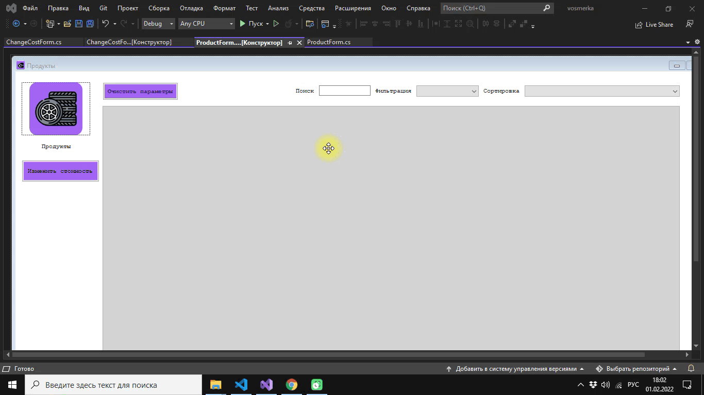

# Windows Forms. Сортировка. Фильтрация. Поиск

## Сортировка

Создадим выпадающий список для сортировки. Пользователь должен иметь возможность отсортировать продукцию (по возрастанию и убыванию) по следующим параметрам: наименование, номер производственного цеха и минимальная стоимость для агента. Выбор сортировки должен быть реализован с помощью выпадающего списка.
Используйте стиль выпадающего комбинированного списка ```DropDownStyle``` в значении ```DropDownList```


Добавьте в коллекцию выпадающего списка требуемые поля. Например, чтобы добавить сортировку по наименованию по возрастанию можно применить следующий код в обработчике загрузки формы:

```Csharp
comboBoxSort.Items.Add("Название (по возрастанию)");
```
После добавления всех полей должен получиться такой результат


Используйте нижепредставленный код для обработчика события, которое возникает при выборе элемента из выпадающего списка и закрытии этого списка [SelectionChangeCommitted]. Включите в метод обработку остальных полей по возрастанию и по убыванию.

```Csharp
 if(comboBoxSort.Text == "Название (по возрастанию)")
            {
              productDataView = new DataView(productTable, "", "Title ask", DataViewRowState.CurrentRows);
            }

   //...

   productTable = productDataView.ToTable();
   dataGridViewProduct.DataSource = productTable;

```
**Замечание**: объявите ```DataView productDataView``` в классе ProductForm


---

**Readme**: оформить тему "Сортировка". Сделать screenshot
**Git**: сделать соmmit с сообщением "Сортировка"

---


1. Создать выпадающий список для фильтрации. Кроме этого, пользователь должен иметь возможность отфильтровать данные по типу продукта. Все типы из базы данных должны быть выведены в выпадающий список для фильтрации(можно вручную - можно сделать Binding). Первым элементом в выпадающем списке должен быть "Все типы", при выборе которого настройки фильтра сбрасываются.


1. Создадим выпадающий список, по аналогии со списком для сортировки

2. При загрузке формы ```ProductForm``` добавим в коллекцию списка все типы продуктов из базы данных, также как мы это делали для реализации функции сортировки.

Ниже представлен код для фильтрации одного типа. Добавьте все типы продуктов и выполните все поставленные требования к списку фильтрации.

```Csharp

private void comboBoxFilter_SelectionChangeCommitted(object sender, EventArgs e)
        {
            if (comboBoxFilter.Text == "Колесо")
            {  
                DataView productDataView1 = new DataView(sTable, $"ProductTypeID = 1", "", DataViewRowState.CurrentRows);
                sTable = productDataView1.ToTable();
                dataGridView1.DataSource = sTable;
                comboBoxFilter.Enabled = false;
            }
        }

```
**Замечание**: целесообразно проверить данные в базе данных для соответствия определенному типу данных.

**Замечание**: сортировка и фильтрация работают совместно, т.е. на одной таблице данных.

В результате фильтрация должна работать следующим образом:

 


---

**Readme**: оформить тему "Фильтрация". Сделать screenshot
**Git**: сделать соmmit с сообщением "Фильтрация"

---


1. Пользователь должен иметь возможность искать конкретную продукцию, используя поисковую строку. Поиск должен осуществляться по наименованию и описанию продукта. Создайте текстовое поле для поиска и надпись "Поиск".

**Замечание:** Поиск, сортировка и фильтрация должны происходить в реальном времени, без необходимости нажатия
кнопки "найти”/”отфильтровать" и т.п. Фильтрация и поиск должны применяться совместно. Параметры
сортировки, выбранные ранее пользователем, должны сохраняться и во время фильтрации с поиском.


Элемент: текстовое поле
Событие: TextChanged

```Csharp

// Поиск в реальном времени
DataView productDataView = new DataView(productTable, "", "", DataViewRowState.CurrentRows);
productDataView.RowFilter = "(Title like '%' + '" + textBoxSearch.Text + "' + '%') or (Description like '%' + '" + textBoxSearch.Text + "' + '%') ";
if (productDataView.Count == 0)
{
    MessageBox.Show("Отсутствуют реультаты поиска");
}

dataGridViewProduct.DataSource = productDataView;

```


1. Очистим параметры сортировки, поиска и фильтрации. Создадим кнопку, которая будет содержать в обработчике следующий код

```Csharp

            comboBoxFilter.Text = "Все типы";
            comboBoxSort.Text = " ";
            textBoxSearch.Text = " ";

            comboBoxFilter.Enabled = true;

            MessageBox.Show("Параметры очищены");
            dataGridViewProduct.DataSource = productTable;

```


---


**Readme**: оформить тему "Поиск". Сделать screenshot
**Git**: сделать соmmit с сообщением "Поиск"

---

**Дополнительное задание:** В списке продукции необходимо подсвечивать светло-красным цветом те продукты, которые не продавались агентами в последний месяц.
**Замечание**: выполните следующий код в конструкторе
```Csharp

this.dataGridViewProduct.AllowUserToAddRows = false;

```

```Csharp

// Подсветить продукты, которые не продавались в течении месяца

            var listOfStrings = new List<string>();

            connection.Open();
            MySqlCommand cmdFindProductSale = connection.CreateCommand();
            cmdFindProductSale.CommandText = "select ProductId from productsale where SaleDate not between DATE_ADD(current_date(), INTERVAL -2 MONTH) and current_date()";
            MySqlDataReader myReader = cmdFindProductSale.ExecuteReader();

            int i = 0;
            while (myReader.Read())
            {
                listOfStrings.Add(myReader[0].ToString());
                i = i + 1;
            }

            //

            foreach (DataGridViewRow row in dataGridViewProduct.Rows)
            {
                if (listOfStrings.Contains(row.Cells[0].Value.ToString()))
                {
                    dataGridViewProduct.Rows[row.Index].DefaultCellStyle.BackColor = Color.PaleVioletRed;
                };
            }
            connection.Close();
            
            //
```


**Дополнительное задание 2:** Необходимо добавить возможность изменения минимальной стоимости продукции для агента сразу для нескольких выбранных продуктов. Для этой цели реализуйте возможность выделения сразу нескольких элементов в списке продукции, после чего должна появиться кнопка “Изменить стоимость на ...”. При
нажатии на кнопку необходимо отобразить модальное окно с возможностью ввода числового значения,
на которое и будет увеличена стоимость выбранных продуктов. По умолчанию в поле должно быть
введено среднее значение цены на продукцию для агента. После нажатия кнопки “Изменить” стоимость
выделенных продуктов должна быть изменена в базе данных, а также обновлена в интерфейсе.

---

1. Создадим кнопку с именем ```changeCostButton```. По умолчанию кнопка будет скрыта.

2. Создадим новый класс ```Info``` для передачи данных между формами

```Csharp

 // Класс связи
    public static class Info
    {
        public static string ID { get; set; }
        public static string Title { get; set; }
        public static string ProductTypeID { get; set; }
        public static string ArticleNumber { get; set; }
        public static string Description { get; set; }
        public static string Image { get; set; }
        public static string ProductionPersonCount { get; set; }
        public static string ProductionWorkshopNumber { get; set; }
        public static string MinCostForAgent { get; set; }
        public static string StateButton { get; set; }
        public static string[] SelectedRowsArray { get; set; }
        
        public static ProductForm ProductForm { get; set; }
        
    }

```

3. Далее создадим обработку события по выделению одной строки или нескольких строк. Для этого нам надо в конструкторе написать следующий код 

```Csharp
this.dataGridViewProduct.SelectionMode = DataGridViewSelectionMode.FullRowSelect;
```

Код события DataGridView

```Csharp

 private void dataGridViewProduct_CellMouseUp(object sender, DataGridViewCellMouseEventArgs e)
        {

            changeCostButton.Visible = true;

            string[] array = new string[dataGridView1.SelectedRows.Count];

            int i = 0;
            foreach (DataGridViewRow row in dataGridView1.SelectedRows)
            {
                array[i] = row.Cells[0].Value.ToString();

                i = i + 1;
            }

            if (e.RowIndex >= 0)
            {

                Info.SelectedRowsArray = array;
                dataGridView1.Rows[e.RowIndex].Selected = true;
                
                Info.MinCostForAgent = dataGridView1.Rows[e.RowIndex].Cells["MinCostForAgent"].Value.ToString();
                Info.Title = dataGridView1.Rows[e.RowIndex].Cells["Title"].Value.ToString();
                Info.ID = dataGridView1.Rows[e.RowIndex].Cells["ID"].Value.ToString();
                Info.ProductTypeID = dataGridView1.Rows[e.RowIndex].Cells["ProductTypeID"].Value.ToString();
                Info.ArticleNumber = dataGridView1.Rows[e.RowIndex].Cells["ArticleNumber"].Value.ToString();
                Info.Image = dataGridView1.Rows[e.RowIndex].Cells["Image"].Value.ToString();
                Info.ProductionPersonCount = dataGridView1.Rows[e.RowIndex].Cells["ProductionPersonCount"].Value.ToString();
                Info.ProductionWorkshopNumber = dataGridView1.Rows[e.RowIndex].Cells["ProductionWorkshopNumber"].Value.ToString();
                Info.Description = dataGridView1.Rows[e.RowIndex].Cells["Description"].Value.ToString();

            }
        }

```


1. Создадим переход на форму изменения цены по нажатию кнопки "Изменить стоимость". На форме будет текстовое поле, кнопка "Изменить" и кнопка "Отмена".

```Csharp

ChangeCostForm form = new ChangeCostForm();
form.ShowDialog();

```


2. Далее в текстовом поле на при загрузке формы ```ChangeCostForm``` по умолчанию должно стоять средняя минимальная стоимость для агента. Здесь мы используем агрегатную функцию ```avg``` в select запросе к базе данных.
**Замечание**: так как мы работает в новой форме, то надо позаботиться о подключении всех библиотек.

В обработчике загрузчика формы пропишем данный код:

```Csharp
            string connectionString = @"server=localhost;userid=root;password=root;database=vosmerka;charset=utf8";
            
            string sql = "select round(avg(MinCostForAgent),2) from product";
            MySqlConnection connection = new MySqlConnection(connectionString);
            connection.Open();
            MySqlCommand sCommand = new MySqlCommand(sql, connection);
            string result = sCommand.ExecuteScalar().ToString();
            textBoxChangeCost.Text = result.Replace(",",".");
            connection.Close();
```


1. Создадим новую таблицу в базе данных ```productchangecosthistory```. Таблица будет хранить историю изменения минимальной цена для агента конкретного продукта. Выполните данный код на языке SQL в MySql Workbench или создайте таблицу визуальными средствами.

```sql

CREATE TABLE `productchangecosthistory` (
  `id` int(11) NOT NULL AUTO_INCREMENT,
  `product_id` int(11) NOT NULL,
  `old_cost` decimal(10,2) NOT NULL,
  `new_cost` decimal(10,2) NOT NULL,
  `dateChange` date DEFAULT NULL,
  PRIMARY KEY (`id`),
  KEY `product_id_idx` (`product_id`),
  CONSTRAINT `product_id` FOREIGN KEY (`product_id`) REFERENCES `product` (`ID`) ON DELETE CASCADE ON UPDATE CASCADE
) ENGINE=InnoDB AUTO_INCREMENT=162 DEFAULT CHARSET=utf8

```


2. Ниже представлен обработчик кнопки изменить.

```Csharp

            string connectionString = @"server=localhost;userid=root;password=root;database=vosmerka;charset=utf8";
            string sql = $"select * from product";
            MySqlConnection connection = new MySqlConnection(connectionString);
            connection.Open();

            // Поиск старой цены

            string[] array = new string[Info.SelectedRowsArray.Length];
            int i = 0;
            foreach (string id1 in Info.SelectedRowsArray)
            {

                MySqlCommand oldCostCommand = new MySqlCommand($"select MinCostForAgent from product where id = {id1}", connection);
                MySqlDataAdapter oldCostadapter = new MySqlDataAdapter(oldCostCommand);
                string oldCostresult = oldCostCommand.ExecuteScalar().ToString();
                array[i] = oldCostresult;
                i = i + 1;
            }

            // Обновление цены в продуктах
            sCommand = new MySqlCommand(sql, connection);
            MySqlDataAdapter adapter = new MySqlDataAdapter(sCommand);

            foreach (string id in Info.SelectedRowsArray)
            {
                adapter.UpdateCommand = new MySqlCommand($"update product set MinCostForAgent = MinCostForAgent + '{textBoxChangeCost.Text.Replace(",",".")}' where id = '{id}'", connection);
                adapter.UpdateCommand.ExecuteNonQuery();
            }


            //

            MySqlCommand changeCostCommand = new MySqlCommand($"select * from productchangecosthistory", connection);
            MySqlDataAdapter changeCostadapter = new MySqlDataAdapter(changeCostCommand);
            i = 0;
            
            foreach (string id in Info.SelectedRowsArray)
            {
                var newCost = Convert.ToDecimal(array[i].Replace(".", ",")) + Convert.ToDecimal(textBoxChangeCost.Text.Replace(".",","));

                adapter.InsertCommand = new MySqlCommand($"insert into productchangecosthistory(product_id,old_cost,new_cost) values('{id}','{array[i].Replace(",", ".")}','{newCost.ToString().Replace(",", ".")}')", connection);
                adapter.InsertCommand.ExecuteNonQuery();
                i = i + 1;
            }


            MessageBox.Show("Цена для агента обновлена в базе данных. История изменения записана!");


```


**Замечание**: возможно вы заметили, что изменения происходят не сразу, а после перезагрузки приложения. Мы решим даннную проблему позже.


**Readme**: оформить тему "Изменение стоимости". Сделать screenshot
**Git**: сделать соmmit с сообщением "Изменение стоимости"

---


