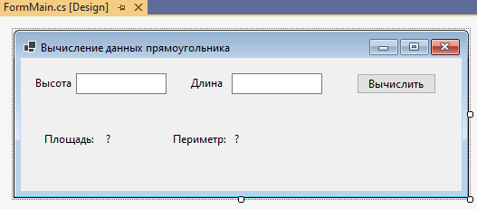
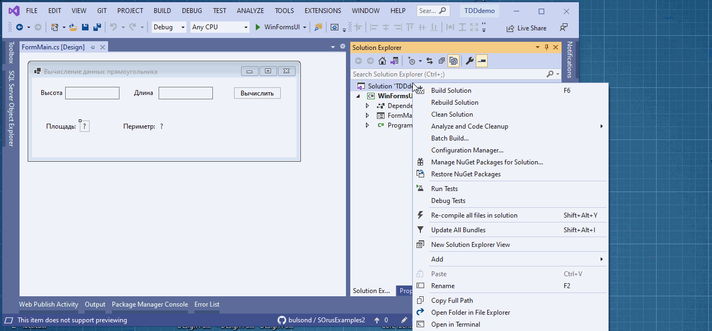
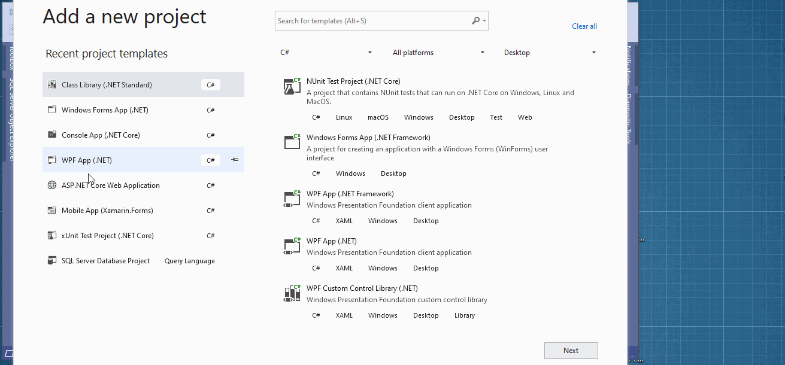
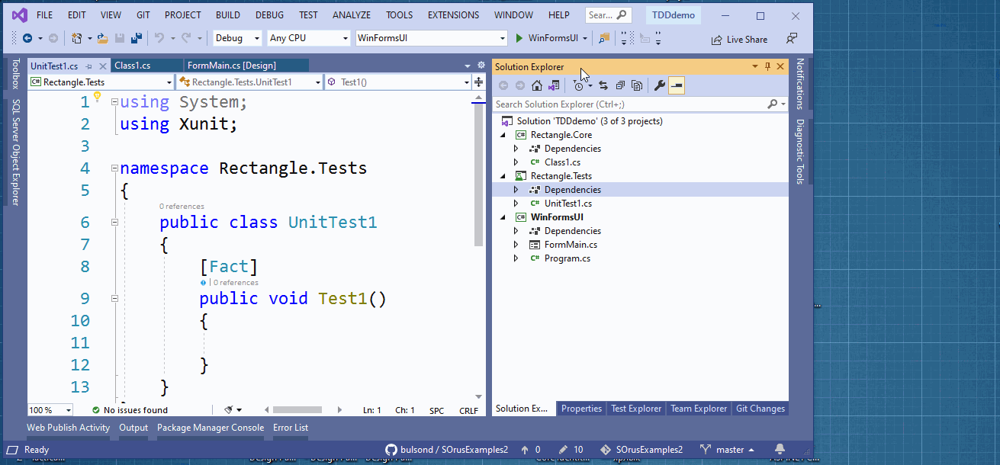
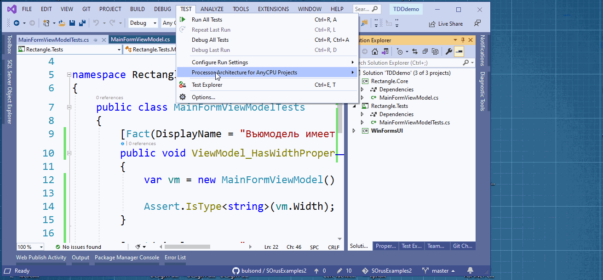

**9. Windows Forms. Тестирование и сборка проекта.**


Рассмотрим пример вычисления данных прямоугольника. Работать будем с уклоном в TDD(test drive development или "Разработка на основе тестирования"). Создадим решение с проектом, набросаем интерфейс программы.




1 Добавьте в решение проект библиотеки


2. Добавьте в решение тестовый проекта xUnit



3. Добавьте ссылки



4. Создайте в проекте библиотеки класс ```MainFormViewModel``` и добавьте ```using Rectangle.Core;```. Напишите пару таких тестов.


```Csharp

public class MainFormViewModelTests
{
 [Fact(DisplayName = "Въюмодель имеет свойство ширины")]
 public void ViewModel_HasWidthProperty()
 {
     var vm = new MainFormViewModel();

     Assert.IsType<string>(vm.Width);
 }

 [Fact(DisplayName = "Въюмодель имеет свойство длины")]
 public void ViewModel_HasLengthProperty()
 {
     var vm = new MainFormViewModel();

     Assert.IsType<string>(vm.Length);
 }
}


```
Так как в классе не было создано соответствующих свойств, то действуйте так


6. Теперь запустите тесты




Тесты не должны пройти. Это нормально. Так и должно быть. Исправьте класс так

```Csharp

public class MainFormViewModel
{
    public string Width { get; set; }
    public string Length { get; set; }
}

```

а тесты так

```Csharp

[Fact(DisplayName = "Въюмодель имеет свойство ширины")]
    public void ViewModel_HasWidthProperty()
    {
        var vm = new MainFormViewModel();

        vm.Width = "3";

        Assert.IsType<string>(vm.Width);
        Assert.Equal("3", vm.Width);
    }

    [Fact(DisplayName = "Въюмодель имеет свойство длины")]
    public void ViewModel_HasLengthProperty()
    {
        var vm = new MainFormViewModel();

        vm.Length = "3";

        Assert.IsType<string>(vm.Length);
        Assert.Equal("3", vm.Length);
    }

```

Добавьте еще два теста

```Csharp

[Fact(DisplayName = "Вычисляет площадь прямоугольника")]
    public void ViewModel_CalculateArea()
    {
        var vm = new MainFormViewModel();
        vm.Width = "3";
        vm.Length = "3";

        int area = vm.GetArea();

        Assert.Equal(9, area);
    }

    [Fact(DisplayName = "Вычисляет периметр прямоугольника")]
    public void ViewModel_CalculatePerimeter()
    {
        var vm = new MainFormViewModel();
        vm.Width = "3";
        vm.Length = "3";

        int perimeter = vm.GetPerimeter();

        Assert.Equal(12, perimeter);
    }

```
и два соответствующих метода в класс вьюмодели. Тесты не пройдут. Подправьте так методы

```Csharp

public int GetPerimeter()
    {
        return 12;
    }

public int GetArea()
    {
        return 9;
    }

```

Убедитесь, что тесты теперь проходят. Далее реализуете методы уже так, чтобы они действительно вычисляли нужные данные и проверяете, что все тесты проходят.

```Csharp

public class MainFormViewModelTests
{
    [Fact(DisplayName = "Въюмодель имеет свойство ширины")]
    public void ViewModel_HasWidthProperty()
    {
        var vm = new MainFormViewModel();

        vm.Width = "3";

        Assert.IsType<string>(vm.Width);
        Assert.Equal("3", vm.Width);
    }

    [Fact(DisplayName = "Въюмодель имеет свойство длины")]
    public void ViewModel_HasLengthProperty()
    {
        var vm = new MainFormViewModel();

        vm.Length = "3";

        Assert.IsType<string>(vm.Length);
        Assert.Equal("3", vm.Length);
    }

    [Fact(DisplayName = "Вычисление площади выбрасывает исключение если высота не число")]
    public void ViewModel_CalculateArea_ThrowsExceptionIfWidthIsNotNumber()
    {
        var vm = new MainFormViewModel();
        vm.Width = "a";
        vm.Length = "3";

        Assert.Throws<ArgumentException>("Width", () => vm.GetArea());
    }

    [Fact(DisplayName = "Вычисление площади выбрасывает исключение если высота отрицательное число")]
    public void ViewModel_CalculateArea_ThrowsExceptionIfWidthIsNegativeNumber()
    {
        var vm = new MainFormViewModel();
        vm.Width = "-3";
        vm.Length = "3";

        Assert.Throws<ArgumentException>("Width", () => vm.GetArea());
    }

    [Fact(DisplayName = "Вычисление площади выбрасывает исключение если высота равна нулю")]
    public void ViewModel_CalculateArea_ThrowsExceptionIfWidthEqualsZero()
    {
        var vm = new MainFormViewModel();
        vm.Width = "0";
        vm.Length = "3";

        Assert.Throws<ArgumentException>("Width", () => vm.GetArea());
    }

    [Fact(DisplayName = "Вычисление площади выбрасывает исключение если высота не число")]
    public void ViewModel_CalculateArea_ThrowsExceptionIfLengthIsNotNumber()
    {
        var vm = new MainFormViewModel();
        vm.Width = "3";
        vm.Length = "a";

        Assert.Throws<ArgumentException>("Length", () => vm.GetArea());
    }

    [Fact(DisplayName = "Вычисление площади выбрасывает исключение если длина отрицательное число")]
    public void ViewModel_CalculateArea_ThrowsExceptionIfLengthIsNegativeNumber()
    {
        var vm = new MainFormViewModel();
        vm.Width = "3";
        vm.Length = "-3";

        Assert.Throws<ArgumentException>("Length", () => vm.GetArea());
    }

    [Fact(DisplayName = "Вычисление площади выбрасывает исключение если длина равна нулю")]
    public void ViewModel_CalculateArea_ThrowsExceptionIfLengthEqualsZero()
    {
        var vm = new MainFormViewModel();
        vm.Width = "3";
        vm.Length = "0";

        Assert.Throws<ArgumentException>("Length", () => vm.GetArea());
    }

    [Theory(DisplayName = "Вычисляет площадь прямоугольника")]
    [InlineData("3", "3", 9)]
    [InlineData("5", "10", 50)]
    public void ViewModel_CalculateArea(string width, string length, int output)
    {
        var vm = new MainFormViewModel();
        vm.Width = width;
        vm.Length = length;

        int area = vm.GetArea();

        Assert.Equal(output, area);
    }

    [Theory(DisplayName = "Вычисляет периметр прямоугольника")]
    [InlineData("3", "3", 12)]
    [InlineData("5", "10", 30)]
    public void ViewModel_CalculatePerimeter(string width, string length, int output)
    {
        var vm = new MainFormViewModel();
        vm.Width = width;
        vm.Length = length;

        int perimeter = vm.GetPerimeter();

        Assert.Equal(output, perimeter);
    }
}

```

К такому тестируемому классу


```Csharp
public class MainFormViewModel
{
    public string Width { get; set; }
    public string Length { get; set; }

    public int GetPerimeter()
    {
        int width = GetWidth();
        int length = GetLength();

        return 2 * width + 2 * length;
    }

    public int GetArea()
    {
        int width = GetWidth();
        int length = GetLength();

        return width * length;
    }

    private int GetLength()
    {
        if (int.TryParse(Length, out int length) == false)
        {
            throw new ArgumentException("Длина должна быть числом.", nameof(Length));
        }
        if (length <= 0)
        {
            throw new ArgumentException("Длина должна быть положительным числом.", nameof(Length));
        }

        return length;
    }

    private int GetWidth()
    {
        if (int.TryParse(Width, out int width) == false)
        {
            throw new ArgumentException("Высота должна быть числом.", nameof(Width));
        }
        if (width <= 0)
        {
            throw new ArgumentException("Высота должна быть положительным числом.", nameof(Width));
        }

        return width;
    }
}

```

7. Теперь используем класс ```ViewModel``` так


```Csharp

 public partial class FormMain : Form
 {
 private readonly MainFormViewModel _viewModel = new MainFormViewModel();

 public FormMain()
 {
     InitializeComponent();

     //привязки
     _textBoxWidth.DataBindings.Add("Text", _viewModel, nameof(MainFormViewModel.Width));
     _textBoxLength.DataBindings.Add("Text", _viewModel, nameof(MainFormViewModel.Length));

     _buttonDoCalc.Click += ButtonDoCalc_Click;
 }

 private void ButtonDoCalc_Click(object sender, EventArgs e)
 {
     try
     {
         _labelArea.Text = _viewModel.GetArea().ToString();
         _labelPerimeter.Text = _viewModel.GetPerimeter().ToString();
     }
     catch (Exception ex)
     {
         MessageBox.Show(ex.Message, "Ошибка");
     }
 }
 }

```

## Разработка тестовых сценариев (Test-cases)

30. Для выполнения процедуры тестирования удаления продукции Вам нужно описать пять сценариев.
Удаление может быть выполнимо, а может быть отклонено согласно требованиям предметной области.

31. Необходимо, чтобы варианты тестирования демонстрировали различные исходы работы алгоритма. Для
описания тестовых сценариев в ресурсах предоставлен шаблон testing-template.docx.
**Решение**: пишем unit тесты по тестовым сценариям, тестируем метод удаления


**Readme**: оформить тему "Тестирование". Сделать screenshot.
**Git**: сделать соmmit с сообщением "Тестирование"


---
## Создание инсталлятора для настольного приложения

29. Вам необходимо создать инсталлятор вашего настольного приложения (например, setup.exe). Нет
необходимости разворачивать базу данных на сервере во время установки, так как во время разработки
вы уже использовали удаленное подключение. Однако при использовании ресурсов (например, папки с
изображениями) или библиотек убедитесь, что они включены в созданный вами установщик.
Рекомендуем проверить процесс установки приложения на вашем рабочем месте перед сохранением
результатов работ.

---

**Readme**: оформить тему "Создание инсталлятора". Сделать screenshot
**Git**: сделать соmmit с сообщением "Создание инсталлятора"

---


