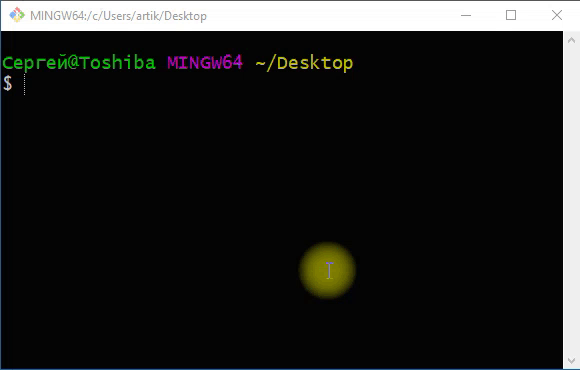
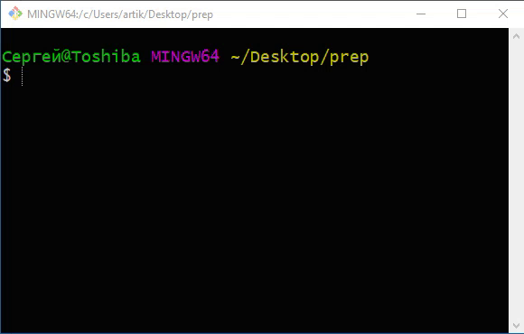
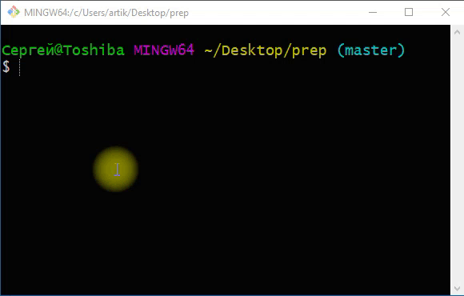
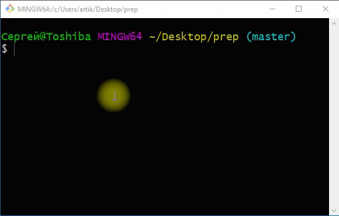
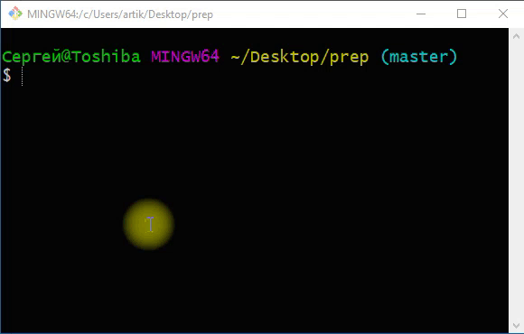

**Работа с Git, Markdown, оформление репозитория ( основы git, основы разметки Markdown ).**

1. Работа с системой контроля версий Git
2. Работа с удаленными репозиториями на сервере git..scc
3. Язык разметки Markdown. Оформление файла описания readme.md

---

1. Создайте в рабочей директории папку с вашим сетевым именем, командой ```mkdir имя_папки```
2. Перейдите из-под командной строки (или используя Git Bash) в созданную папку.
   



3. Проинициализируйте папку с помощью системы контроля версий Git: ```git init```.



4. Создайте текстовый файл с расширением ```md```. Таким образом, файл будет принимать разметку языка ```Markdown```. Назовите файл ```README.md```.



6. Заготовка содержимого файла README.md представлена в ресурсах.


7. Прочтите правила оформления разметки на языке ```Markdown```. Также представлены в ресурсах.

8.  Добавить все файлы в отлеживаемые системой git. Для этого вам потребуется команда: ```git add .```




11. Далее, перед первой точкой сохранения (commit) вам следует настроить учетные данные:
Например
    ```
      git config --global user.name "ivanov_01ip000"
      git config --global user.email 01ip000@git.scc
    ```



12. Теперь сделайте коммит: ```git commit -m " "  ```. Здесь, обязательно, в кавычках написать сообщение. Сообщение следует писать согласно заданию для каждого дня. Сейчас напишите в кавычках ``` Подготовка к работе ```. Проверить все коммиты можно командой ```git log```.


14. Далее создайте удаленный репозиторий на удаленном git сервере. В данном случае, это сервер ```git.scc/git```. При создании удаленного репозиторий выберите в опциях также преподавателя в качестве admin, чтобы он мог смотреть ваш репозиторий.


15. Свяжите локальный репозиторий (вашу главную папку) и удаленный репозиторий на сервере git.scc с помощью команды: ```git remote add <name repo> <link_remote_repo>```

    - <name repo> - имя репозитория на удаленном сервере.
    - <link_remote_repo> - ссылка на удаленный репозиторий.


16. Отправьте изменения на удаленный сервер с помощью команды push:  ```git push -u origin master```. Сервер может попроcить у вас ввести логин и пароль. При возникновении ошибки аутентификации выполните команду заново. Если аутентификация не проходит смените оболочку Git Bash, на командную строку.


    
17. Часто вам может потребоваться использовать принудительную загрузку структуры локального репозитория. Для этого используйте флаг --force или -f: ```git push -u origin master -f```.

18. Проверьте правильность отображения данных на удаленном сервере.
    
19. При дальнейшей работе потребуется выполнить только три команды: ```git add . ```, ```git commit -m "message" ```, ```git push <name_rep> master```.
  
    - <name_rep> - имя удаленного репозитория
    - master - основная ветка

20. Как правильно заливать изображения на сервер, чтобы они отображались в файле README.md? Сначала залейте на сервер физически ресурсы: изображения, gif, документы или другие файлы. Далее в файле README.md пропишите ссылки на пути, которые лежат на удаленном сервере.

21. Создайте файл описания (readme.md) для первого дня. Оформите с помощью разметки Markdown список используемых команд git и что каждая команда означает. Сделайте это списком.
22. Посмотрите все свои коммиты. Сделайте скриншот.
23. Посмотрите все привязанные удаленные репозитории командой ```git remote -v ```. Сделайте скриншот.
24. Все скриншоты должны лежать в папке ```images```. 
25. Сделайте первый день в оглавлении.