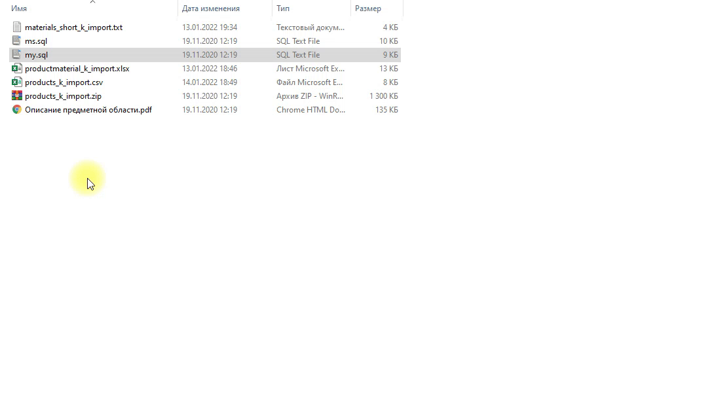

**4. Импорт данных**

## Импорт данных

Заказчик системы предоставил файлы с данными (с пометкой import в ресурсах) для переноса в новую
систему. Подготовьте данные файлов для импорта и загрузите в разработанную базу данных.


# Решение

1. Найдите в ресурсах **Сессия 1** файлы для импорта. Для создания подсистемы нам нужны таблицы продуктов, материалов и связующая таблица продуктов и материалов. Особое внимание уделите сопоставлению таблиц (названия столбцов, последовательность столбцов, ограничения целостности, т.е. внешние ключи к другим таблицам ) в скрипте базы данных.

- materials_short_k_import.txt
- productmaterial_k_import.xlsx
- products_k_import.csv



2. Сохраним файл для импорта материалов в формат csv. Откроем через Excel


3. Конвертируем в csv
   


4. Отредактируйте файл для импорта данных в таблицу Materials (полей минимальная стоимость очистите от слов "рублей","руб","₽"). Полей Номер цеха очистите от лишних символов. Используйте автоматическую замену ```Ctrl + H```


5. Сопоставим последовательность столбцов в таблице Материалы и изменим последовательность в файле для импорта. Отредактируйте в Excel последовательность столбцов с помощью ```Shift```


6. Как видно из столбца ```Тип материала``` все значения представлена конкретными названиями материалов, а должны быть представлены внешними ключами. Для замены создадим второй лист и назовем его **MaterialType** с полями id и type. В данной таблице будет 2 записи: Резина и Шины. Также переименуем первый лист в Materials


7. Свяжем два листа Materials и MaterialType используя функцию ПРОСМОТР. Сначала создадим дублирующий столбец ```Тип материала```. В данном случае для функции используются следующие координаты
=ПРОСМОТР(J2;MaterialType!B2:B3;MaterialType!A2:A3)

**Замечание 1**: бываются случаи, когда надо заново перенабрать текст в ячейке (Резина, Шипы), чтобы ассоциация сработала


8. Для применения данной формулы для всех значений столбца надо применить глобальные ссылки, потому как они ссылаются на столбцы в таблице MaterialType. Для копирования функции просмотра на все строки надо частично использовать абсолютные ссылки с добавлением знака ```$``` перед адресов ячейки.

=ПРОСМОТР(J2;MaterialType!$B$2:$B$3;MaterialType!$A$2:$A$3)


9. Сейчас нельзя удалять старый столбец Тип материала поскольку она связан. При закрытии файла csv с созданными листами и последующем открытии он оставляет только один лист. При этом значения внешних ключей уже не будут вычислимыми, а будут просто значениями. Теперь можно удалить старый столбец.


10. Далее внесем реальные данные в таблицу MaterialType в нашей базе данных


11.  Отредактируйте аналогично таблицу **Product**
12.  Отредактируйте также таблицы **MaterialsProducts**

**Замечание 2**: форматирвоание и загрузка данных в связующую таблицу **MaterialsProducts**. Здесь данные назодятся в формате xlsx. В данном случае, частая проблема при импорте заключатеся в том, что "слетает" кодировка. Таким образом, надо пересохранить файл в формат сsv с кодировкой UTF-8. При этом разделитель все равно остается ";"

**Замечание 3**: cтолбец по которому осуществляется поиск через функцию ПРОСМОТР надо сортировать **обязательно**, иначе просмотр не будет корректно работать

13.  Загрузите командой ```LOAD DATA``` данные в таблицы базы данных.

  ```sql
  LOAD DATA LOCAL INFILE 'C:/...' INTO TABLE table
    FIELDS TERMINATED BY ';'
    LINES TERMINATED BY '\n'
    IGNORE 1 LINES;
  ```

14. Импорт данных в таблицу **Product**

```sql

  LOAD DATA LOCAL INFILE 'C:/Users/artik/Desktop/Study-practice/edit/_products_k_import.csv' INTO TABLE Product
    FIELDS TERMINATED BY ';'
    LINES TERMINATED BY '\n'
    IGNORE 1 LINES;
```


15. Импорт данных в таблицу **Material**

```sql

  LOAD DATA LOCAL INFILE 'C:/Users/artik/Desktop/Study-practice/edit/_materials_short_k_import1.csv' INTO TABLE Material
    FIELDS TERMINATED BY ';'
    LINES TERMINATED BY '\n'
    IGNORE 1 LINES;

```


16. Импорт данных в таблицу **ProductMaterial**

```sql

  LOAD DATA LOCAL INFILE 'C:/Users/artik/Desktop/Study-practice/edit/_productmaterial_k_import.csv' INTO TABLE Productmaterial
    FIELDS TERMINATED BY ';'
    LINES TERMINATED BY '\n'
    IGNORE 1 LINES;

```


17. Возможно вам понадобятся следующие команды

```sql
SET SQL_SAFE_UPDATES = 0;
set global local_infile = 1;
SET FOREIGN_KEY_CHECKS=0;
truncate <database.table>

```

**Замечание 4:** Кроме LOAD DATA, которая зависит от настроек сервера, есть визуальный способ импорта (зависит от клиентской программы), импорт LOAD DATA через командную строку (нужен исполняемый файл mysql.exe), стандартная команда INSERT INTO (если ничего не работает, можно и нужно использовать INSERT INTO)

---
**Возможные ошибки**
```
Error Code: 1452. Cannot add or update a child row: a foreign key constraint fails (`vosmerka`.`material`, CONSTRAINT `FK_Material_MaterialType` FOREIGN KEY (`MaterialTypeID`) REFERENCES `materialtype` (`ID`) ON DELETE NO ACTION ON UPDATE NO ACTION)

```
**Решение**: ``` SET FOREIGN_KEY_CHECKS=0 ``` отменяет проверку ограничений внешних ключей на время

